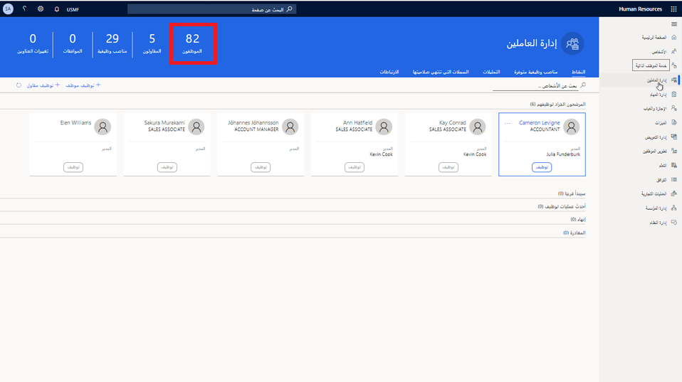

---
demo:
  title: 'العرض التوضيحي 1: تعيين دورات التعلم'
  module: 'Module 4: Learn the Fundamentals of Microsoft Dynamics 365 Human Resources'
ms.openlocfilehash: 06483c659174e77391b0181963299d51f2011d35
ms.sourcegitcommit: 252458fca8e71b6e5e8b99ae4c2b47cd85461a30
ms.translationtype: HT
ms.contentlocale: ar-SA
ms.lasthandoff: 01/27/2022
ms.locfileid: "137909163"
---
## العرض التوضيحي 1 - تعيين دورات التعلم

1. استعرض للوصول إلى صفحة **Microsoft Dynamics 365 Human Resources** الرئيسية.  
    في Microsoft Dynamics 365 Human Resources، يمكن لمديري الموظفين تعيين دورات تدريبية للموظفين. في هذا المثال، يجب تعيين موظفة الشركة الجديدة -أليسيا- على التدريب المتاح للموظفين خلال أول ثلاثين يومًا.

1. في منتقي الشركة العلوي الأيمن، تحقق من أن الشركة التي تتصل بها هي **USMF**. إذا لم تكن كذلك، غيرها إلى **USMF**.

1. في الزاوية العلوية اليسرى من الشاشة، حدد علامة التبويب **إدارة الأفراد.**

1. على الجانب الأيمن من صفحة **إدارة الأفراد**، انقر فوق الرقم الموجود أعلى كلمة **الموظفون** مباشرةً.

    

1. في جدول **الموظفين**، حدد اسم الموظف الذي تريد تعيين تدريب له. على سبيل المثال، **Alicia Thornber**.  
    بعد ذلك، استخدم علامة التبويب "الاختصاصات والتطوير" للاطلاع على ارتباطات إلى معلومات حول شهادات الموظف وتعليمه ومهاراته.

1. في صفحة الموظف، حدد علامة التبويب **الاختصاصات والتطوير.**

1. في **قسم الاختصاصات**، حدد **الدورات**.  
    من صفحة "الدورات التدريبية" الخاصة بالموظف، يمكنك معرفة ما إذا تم تعيين أي دورات تدريبية له. في حالة أليسيا، لم يتم سرد أي دورات. لعرض الدورات التدريبية المتاحة لتعيينها إليها، تحتاج إلى تحديد قائمة "معرف الدورة التدريبية".

1. حدد قائمة **معرف الدورة التدريبية.**

1. في جدول الدورات التدريبية، حدد قائمة **معرف الدورة التدريبية.**

1. في قائمة **معرف الدورة التدريبية**، حدد قائمة **حالة الدورة التدريبية.**

1. في قائمة **حالة الدورة التدريبية**، حدد المربع **حالة الدورة التدريبية هي بالضبط.**  
    قد تحتاج بعد ذلك إلى تحرير عامل تصفية **معرف الدورة التدريبية** الذي يتم تطبيقه، مثل تغيير عامل التصفية لعرض الدورات التدريبية المفتوحة فقط.

1. في مربع **حالة الدورة التدريبية هي بالضبط**، أدخل **فتح**.

1. في قائمة **حالة الدورة التدريبية**، حدد **تطبيق** لمشاهدة جميع الدورات التدريبية المفتوحة المتاحة.  
    الآن، يمكنك تعيين دورة تدريب الموظف الجديد إلى أليسيا.

1. حدد الدورة التي ترغب في تعيينها. على سبيل المثال، **00006 تدريب الموظف الجديد**.

1. في جزء "نقل بيانات الدورة التدريبية"، حدد **نعم**.

1. في صفحة **الدورات التدريبية**، في عمود **تاريخ البدء**، حدد أيقونة **التقويم**.

1. في التقويم، حدد تاريخ البدء. على سبيل المثال، **5 يناير 2021**.

1. في عمود **تاريخ الانتهاء**، حدد أيقونة **التقويم**.

1. في التقويم، حدد تاريخ انتهاء التدريب. على سبيل المثال، **8 يناير 2021**.

1. على الجانب الأيسر من صفحة **الدورات التدريبية**، حدد **حفظ** لحفظ التغييرات.

1. على الجانب الأيمن من صفحة **الدورات التدريبية**، حدد **X** لإغلاق الصفحة.  
    إذا كنت بحاجة إلى تغيير أي دورة تدريبية معينة، حدد "الدورات" مرة أخرى.

1. في صفحة **الموظف**، في قسم **الاختصاصات**، حدد **الدورات التدريبية**.

1. في صفحة **الدورات التدريبية**، في شريط التنقل، حدد **تحرير** لإجراء التغييرات.

1. في عمود **تاريخ البدء**، حدد أيقونة **التقويم**.

1. حدد تاريخ البدء الجديد للدورة. على سبيل المثال، **6 يناير 2021**.

1. حدد ⁧**⁩حفظ⁧**⁩.

1. حدد أيقونة **X** لتحميل الصفحة الجديدة.

1. في صفحة **الموظف**، حدد أيقونة **X** لإغلاق الصفحة.
