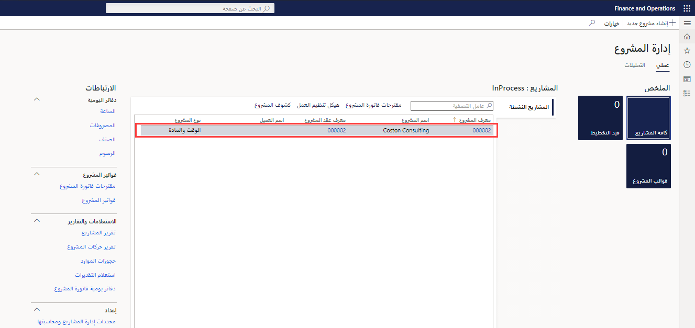
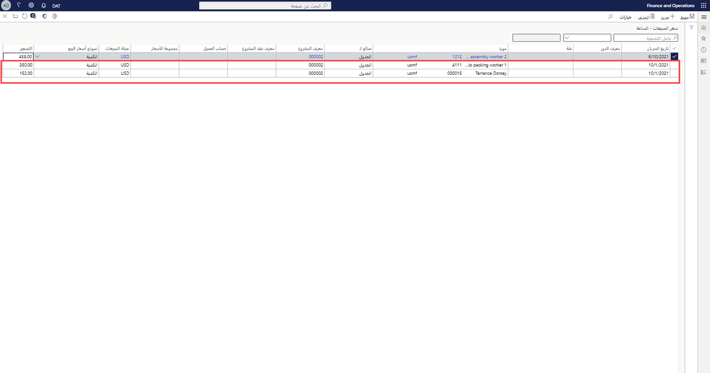
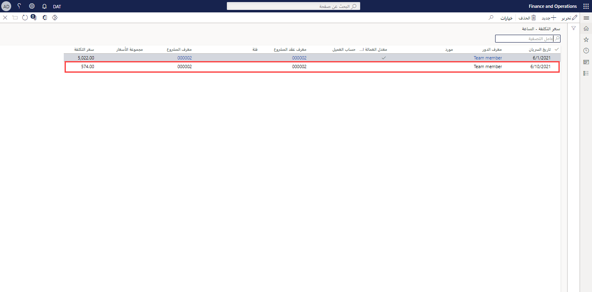

    <article class="markdown-body entry-content container-lg" itemprop="text"><table>
  <thead>
  <tr>
  <th>demo</th>
  </tr>
  </thead>
  <tbody>
  <tr>
  <td>
<table>
  <thead>
  <tr>
  <th>title</th>
  <th>module</th>
  </tr>
  </thead>
  <tbody>
  <tr>
  <td>
العرض التوضيحي 1: تسعير Project Operations
</td>
  <td>
الوحدة 5: تعرف على أساسيات Microsoft Dynamics 365 Project Operations
</td>
  </tr>
  </tbody>
</table>

</td>
  </tr>
  </tbody>
</table>

## العرض التوضيحي 1 - تسعير Project Operations

1. استعرض للوصول إلى مساحة عمل **إدارة المشروع.**  
    في هذا العرض التوضيحي، سنقوم بإعداد أسعار المبيعات والتكلفة ضمن عمليات المشروع. وسنرى كيف يتم اشتقاق التكلفة والأسعار من فاتورة تم ترحيلها مسبقًا.

1. في منتقي الشركة العلوي الأيمن، تحقق من أن الكيان القانوني الذي تتصل به هو **USSI**.  
    إذا لم يكن كذلك، قم بتغيير المؤسسة إلى **USSI**.

1. في جدول **المشاريع النشطة**، حدد المشروع **00000093 Contoso Consulting**. هذا يفتح عرض تفاصيل المشروع.

    

1. في صفحة **Contoso Consulting**، في شريط التنقل، حدد علامة التبويب **إدارة.**

1. في قائمة **إدارة**، حدد **دفاتر يومية الفواتير**.  
    هنا، حددنا فاتورة حيث تم تطبيق الساعات.

1. ضمن **حركات الفاتورة**، في عمود **سعر المبيعات**، أشر إلى **350.00**.  
    يمكننا أن نرى في هذا العرض أن سعر المبيعات للمورد Aaron Con، مدير مشروعات في USSI، له معدل رسوم يبلغ 350 دولارًا. هيا نراجع إعداد التسعير لنرى كيف تم تحديد هذا السعر.

      

    على الرغم من أنه يمكننا إلقاء نظرة على الأسعار من المشروع الفردي، إلا أننا سنبدأ من مساحة عمل **إدارة المشروع** حتى نتمكن من رؤية جميع الأسعار التي تم إعدادها.

1. استعرض للوصول إلى مساحة عمل **إدارة المشروع.**

1. على الجانب الأيمن من الشاشة، في قسم **الارتباطات**، في القائمة الفرعية **الإعداد**، حدد **سعر المبيعات (بالساعة)**.

1. في صفحة **سعر المبيعات - ساعة**، في **عمود التسعير** بالجدول، أشر إلى **350.00**.  
من طريقة العرض هذه، يمكننا أن نرى أين تم تحديد سعر مبيعات Aaron Con بمبلغ 350 دولارًا.

1. أشر إلى الصف الأول بأكمله.  
    إذا نظرنا عبر الصف بأكمله، يمكننا أن نرى أن Aaron قد تم إعداده كمدير مشروع، وبشكل أكثر تحديدًا، أن السعر مرتبط بمعرف مشروع معين لشركة Contoso Consulting.

1. في عمود **المورد**، أشر إلى جميع الصفوف الأخرى التي تم تعيين الموارد لها.  
    يمكننا أن نرى في هذا الجدول أن هناك مدراء مشاريع آخرين تم إعدادهم أيضًا، لكن لم يتم تخصيصهم على وجه التحديد لمعرفات المشروع، وبالتالي فإن أسعارهم خاصة فقط بالفئة والموارد المعينة.

      

    تتميز هذه المصفوفة بالمرونة الكافية لدعم مستوى التفاصيل التي رأيناها مع شركة Contoso Consulting وAaron Con، بالإضافة إلى دعم نموذج تسعير أكثر عمومية مثل سعر 300 دولار الموضح هنا.

1. بالنسبة إلى مشروع Contoso، انتقل إلى صفحة **دفاتر يومية الفواتير.**  
    بالعودة إلى الفاتورة المُرحلة، سننظر في نفس حركة الساعات المُرحلة ونراجع التكاليف المرتبطة بـ Aaron Con عن طريق تحديد معرّف الحركة في سطر حركة الفاتورة.

1. في قسم **حركات الفاتورة**، حدد علامة التبويب **الساعة.** في الجدول الذي يظهر، في عمود **معرّف الحركة**، حدد معرّف الحركة.

    

1. في صفحة **حركات الساعة**، حدد علامة التبويب **نظرة عامة.** في الجدول الذي يظهر، في عمود **سعر التكلفة**، أشر إلى **200.00**.  
    من عرض المعاملات بالساعة، يمكننا رؤية إدخال Aaron Con وهناك سعر التكلفة المرتبط بـ 200 دولار. هيا نعود ونلقي نظرة على إعداد سعر التكلفة لنرى كيف تم اشتقاق معدل التكلفة هذا.

1. استعرض للوصول إلى مساحة عمل **إدارة المشروع.**

1. على الجانب الأيمن من الشاشة، في قسم **الارتباطات**، في القائمة الفرعية **الإعداد**، حدد **سعر التكلفة (بالساعة)**.

1. في صفحة **طريقة العرض القياسية سعر التكلفة - الساعة**، في الجدول، أشر إلى الصف الذي يحتوي على **1/1/2014** في عمود **تاريخ السريان**، و**PM** في **عمود الفئة**، و**200.00** في عمود **سعر التكلفة**، ولا توجد قيم في الأعمدة الأخرى.  
    من طريقة العرض هذه، يمكنني رؤية سعر تكلفة قدره 200 دولار تم إعداده خصيصًا لفئة PM ولكن لا توجد سطور أخرى خاصة بـ Aaron أو مشروعنا الاستشاري لشركة Contoso. هذه أيضًا ممارسة شائعة حيث تطبق العديد من مؤسسات الخدمة معدلات تكلفة قياسية عبر الفئات، وفي هذه الحالة تم تحديدها هنا على أنها دور مشروع. غالبًا ما تكون هذه التكلفة معدلًا مختلطًا حيث يتم تخزين معدل دفع المورد الفردي فقط في كشوف المرتبات أو نظام الموارد البشرية. سيتم بعد ذلك تعديل معدل التكلفة القياسي على أساس دوري حيث يتم تحليل تكاليف الرواتب للتأكد من أنها دقيقة، ويتم تلبية الهوامش.

    

1. استعرض للوصول إلى مساحة عمل **إدارة المشروع.**

1. على الجانب الأيمن من الشاشة، في **قسم الروابط**، في القائمة الفرعية **الإعداد**، أشر إلى **سعر التكلفة (بالساعة)** **وسعر المبيعات (بالساعة)**.  

في هذا العرض التوضيحي، اكتشفنا كيفية إعداد المبيعات القياسية وأسعار التكلفة في Project Operations. لقد قمنا بمراجعة تأثيرها مقابل الفاتورة المرحلة لاكتساب المعرفة حول كيفية تأثير إعداد هذه الأسعار بشكل مباشر على الوقت وفاتورة المواد المقدمة.
