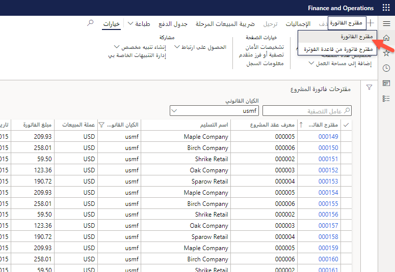
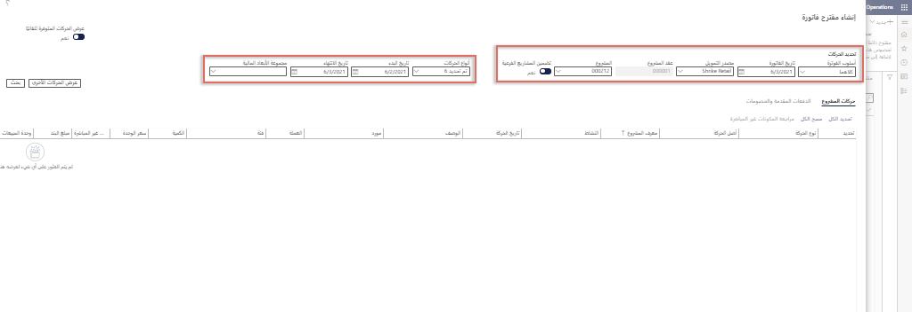
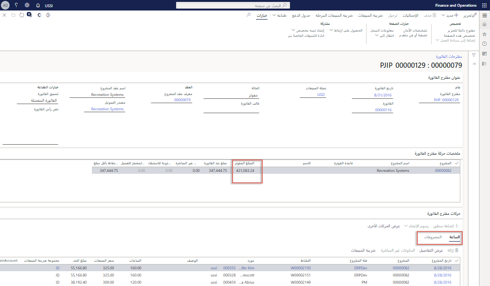
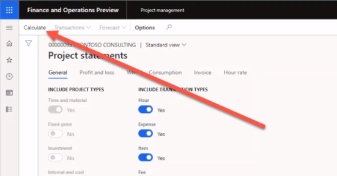

    <article class="markdown-body entry-content container-lg" itemprop="text"><table>
  <thead>
  <tr>
  <th>demo</th>
  </tr>
  </thead>
  <tbody>
  <tr>
  <td>
<table>
  <thead>
  <tr>
  <th>title</th>
  <th>module</th>
  </tr>
  </thead>
  <tbody>
  <tr>
  <td>
العرض التوضيحي 2: إنشاء فاتورة
</td>
  <td>
الوحدة 5: تعرف على أساسيات Microsoft Dynamics 365 Project Operations
</td>
  </tr>
  </tbody>
</table>

</td>
  </tr>
  </tbody>
</table>

## العرض التوضيحي 2 - إنشاء فاتورة

1. استعرض للوصول إلى مساحة عمل **إدارة المشروع.**  
    في هذا العرض التوضيحي، سننتقل إلى عملية فوترة مشروع واحد ضمن عمليات المشروع. على الرغم من أنه من الممكن إجراء فواتير جماعية، إلا أننا سنركز، لأغراض توضيحية، على مرة واحدة فقط وعلى مشروع فعلي. سنرى أيضًا نتائج الترحيل والرؤى المالية في بيان المشروع. لنبدأ بفوترة المشروع. 

1. في منتقي الشركة العلوي الأيمن، تحقق من أن الكيان القانوني الذي تتصل به هو **USSI**. إذا لم يكن كذلك، قم بتغيير الكيان القانوني إلى **USSI**.  
    من مساحة عمل **إدارة المشروع**، يمكننا رؤية جميع المشاريع النشطة. يمكننا البحث عن مشاريع باستخدام عامل التصفية، أو في هذا المثال، سنختار معرف مشروع معلوم. 

1. في جدول **المشاريع النشطة**، في عمود **معرف المشروع**، حدد **00000093 Contoso Consulting**.  

1. بعد ذلك، افتح صفحة **مقترحات فواتير المشروع** لعرض جميع الفواتير السابقة التي تمت معالجتها لشركة Contoso Consulting. 

1. في جزء الإجراءات، في علامة التبويب **الفوترة،** حدد **مقترحات فواتير المشروع.** 

1. في صفحة **مقترحات فواتير المشروع**، في شريط التنقل، حدد **جديد**، ثم **مقترح فاتورة**.  
    هذه فاتورة بسيطة للوقت والمواد، لذلك لا نحتاج إلى تحديد خيار مقترح الفاتورة من قاعدة الفوترة. 

    

1. في الجزء **إنشاء مقترح فاتورة**، أشر إلى المربعات الموجودة ضمن **تحديد الحركات**.  
    من هنا، يمكننا تحديد أشياء مثل طريقة الفوترة وتاريخ الفاتورة ومصدر التمويل والمشروع. يمكننا أيضًا اختيار تضمين المشاريع الفرعية، بالإضافة إلى دمج أنواع الحركات وتواريخ البدء والانتهاء للحركات وأي أبعاد مالية نحتاجها. 

    

1. من القائمة المنسدلة **المشروع**، حدد **00000093 Contoso Consulting**. 

1. في هذا المثال، تأكد من تعيين **تاريخ الفاتورة** على **2/1/21** و**تاريخ البدء** على **2/1/21** وتاريخ الانتهاء هو تاريخ اليوم.  
    بمجرد إجراء التحديدات، حدد زر البحث للعثور على الحركات التي تلبي هذه المعايير.

1. حدد **بحث**.  
    بعد ذلك، لإصدار فاتورة بجميع الحركات، حدد خيار تحديد الكل. سيؤدي هذا إلى تحديد العناصر التي نختارها للمصروفات والساعات.

1. ضمن علامة تبويب **حركات المشروع**، حدد **تحديد الكل**.

1. حدد **موافق**. 

1. في صفحة **مقترح الفاتورة**، أشر إلى عمود **مبلغ سطر الفاتورة.**  
    هنا يمكننا رؤية مبلغ الفاتورة والملخص، وساعات العمل، والمصروفات.

    

1. أشر إلى علامة التبويب **الساعة.** 

1. أشر إلى علامة التبويب **المصروفات.**  
    يمكنك أيضًا التبديل وإلقاء نظرة على حركة المصروفات.  
بعد ذلك، لنتحقق من زر الإجماليات لنرى كيف ستبدو الفاتورة من منظور التكلفة والإيرادات.

1. في شريط التنقل، حدد **الإجماليات**.

1. في صفحة **الإجماليات**، أشر إلى عمود **دفتر الأستاذ العام** وعمود **العميل** وعمود **خصم السطر**.  
    في شاشة الإجماليات، يمكننا معرفة التأثير الذي سيكون على دفتر الأستاذ العام وأي معلومات خاصة بالعميل مثل حدود الائتمان وأي خصومات وضرائب المبيعات والتأثير الصافي للفاتورة. 

1. على الجانب الأيمن من الشاشة، حدد **X** لإغلاق الصفحة.  
    نحن الآن جاهزون لإنشاء معاينة قبل الطباعة للتأكد من دقة جميع معلومات الفواتير. تستخدم بعض المؤسسات المعاينة أثناء اجتماعات مراجعة المشروع للتأكد من موافقة الجميع على الإجماليات قبل إنهاء الفاتورة. 

1. في صفحة **مقترح الفاتورة**، في شريط التنقل، حدد **معاينة الطباعة**. 

1. في مربع الحوار، حدد **معاينة الطباعة**.  
    يمكنك هنا مشاهدة مثال على معاينة الطباعة لفاتورة أولية. 

1. حدد **X** لإغلاق الصفحة.  
    بمجرد أن نتحقق من صحة جميع المعلومات ونكون راضيين عن معاينة طباعة الفاتورة، يمكننا ترحيل مقترح الفاتورة.

1. في شريط التنقل، حدد **ترحيل**.

1. حدد علامة التبويب **المعلمات**.

1. ضمن **المعلمات**، قم بتعيين **الترحيل** إلى **نعم**.

1. ضمن **خيارات الطباعة**، قم بتعيين **طباعة الفاتورة** إلى **نعم**.

1. حدد **موافق**.

1. في صفحة **الفاتورة**، أشر إلى رقم **الفاتورة.**  
    الآن لدينا رقم فاتورة تم إنشاؤه.  
    بعد ترحيل الفاتورة، يمكننا مراجعة المعلومات الموجودة في دفتر يومية الفواتير والانتقال إلى حركات دفتر الأستاذ.

1. استعرض للوصول إلى مساحة عمل **إدارة المشروع.**

1. في جدول **المشاريع النشطة**، حدد المشروع **00000093** **Contoso consulting**.

1. في جزء الإجراءات، في علامة التبويب **الفوترة،** حدد **دفتر يومية الفواتير.**

1. في صفحة **دفتر يومية الفواتير**، في شريط الإجراءات، حدد **الإيصال**.

1. في صفحة **حركات الإيصال**، أشر إلى عمود **حساب دفتر الأستاذ.**  
    هنا نرى النتائج مرحلة في دفتر الأستاذ العام. يتم تحديد حسابات دفتر الأستاذ العام من خلال إعداد الحساب والأبعاد المالية المطبقة على كل مشروع.

1. استعرض للوصول إلى مساحة عمل **إدارة المشروع.** 

1. في جدول **المشاريع النشطة**، حدد مشروع **00000093 Contoso Consulting**.

1. في صفحة **Contoso Consulting**، في شريط التنقل، حدد **التحكم**.  
    من هنا يمكننا رؤية جميع تفاصيل المشروع.  
    بعد ذلك، هيا نلقي نظرة على البيانات المالية للمشروع في كشف المشروع.

1. حدد **كشوف المشروع**.

1. في **كشوف المشروع**، أشر إلى قسم **تاريخ المشروع.**  
يمكنك إنشاء كشف لأي نطاق زمني تريده.

1. حدد المربع **من تاريخ** وأدخل **2/1/2021**.

1. حدد المربع **إلى تاريخ** وأدخل تاريخ اليوم.

1. عند الانتهاء، حدد **حساب**.

    

1. أشر إلى **الحركات**.  
    بمجرد تحديث البيانات، يمكن لمدير المشروع اختيار التعمق أكثر في تفاصيل الحركات لاتخاذ قرارات المشروع أو إجراء التعديلات حسب الضرورة. في هذا العرض التوضيحي، قمنا بمعالجة فاتورة الوقت والمواد مع كل من حركة الساعة والمصروفات. نظرنا إليها في المعاينة، ثم قمنا بترحيل الفاتورة، وراجعنا ترحيل دفتر الأستاذ، وأخيراً راجعنا التأثير المالي من خلال كشف المشروع هذا.
