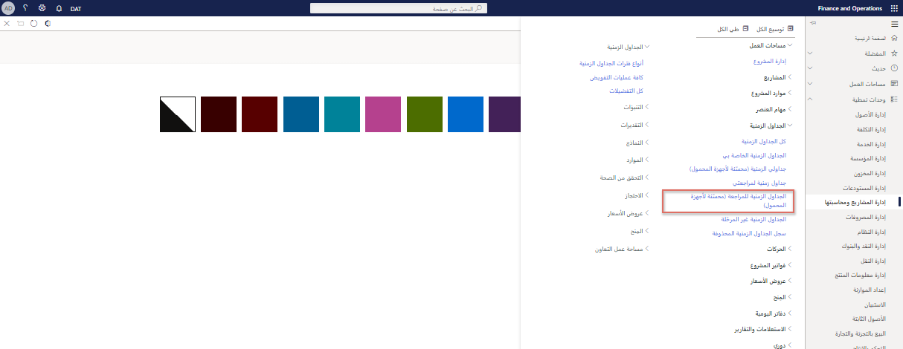

    <article class="markdown-body entry-content container-lg" itemprop="text"><table>
  <thead>
  <tr>
  <th>demo</th>
  </tr>
  </thead>
  <tbody>
  <tr>
  <td>
<table>
  <thead>
  <tr>
  <th>title</th>
  <th>module</th>
  </tr>
  </thead>
  <tbody>
  <tr>
  <td>
العرض التوضيحي 3: استكشف تكاليف المشروع
</td>
  <td>
الوحدة 5: تعرف على أساسيات Microsoft Dynamics 365 Project Operations
</td>
  </tr>
  </tbody>
</table>

</td>
  </tr>
  </tbody>
</table>

## العرض التوضيحي 3 - استكشف تكاليف المشروع

في هذا العرض التوضيحي، سنتعرف على كيفية إنشاء إدخال الوقت والنفقات الذي سيتم تحميله على مشروع Contoso Consulting. سنستكشف الإدخالات بتنسيقات محسّنة للويب والعرض التقديمي للجوال، وسنرى كيف يتم استخدام سير العمل لإدارة عملية الموافقة.

1. في **Dynamics 365 for Finance and Operations**، في جزء التنقل، حدد **الوحدات > إدارة المشاريع ومحاسبتها > الجداول الزمنية > جداولي الزمنية (مُحسّنة لأجهزة المحمول)**.  
    للبدء، على الرغم من أنني لست على جهاز محمول في الوقت الحالي، فسوف تتعرف على النماذج على أنها متوافقة مع الجوّال بعد أن نختار الخيار **جداولي الزمنية (مُحسّنة لأجهزة المحمول)**.

      

    هذا التحسين هو عامل تمييز رئيسي لتطبيقات أعمال Microsoft ويساعد في ضمان وجود حد أدنى من منحنى التعلم بين استخدام الويب والهاتف المحمول.

1. في منتقي الشركة العلوي الأيمن، تحقق من أن الكيان القانوني الذي تتصل به هو **USSI**. إذا لم يكن كذلك، قم بتغيير الكيان القانوني إلى **USSI**.

1. في صفحة **جداولي الزمنية**، حدد **جديد**.  
    سنقوم الآن بإنشاء جدول زمني جديد يعتمد على الإعدادات التي تم تكوينها.

1. في **جزء الجدول الزمني الجديد**، أشر إلى المربع **التاريخ.**  
    سيحدد التاريخ الذي تم إدخاله فترة الجدول الزمني.

1. أشر إلى **إنشاء من المفضلة**.  
    إذا كانت لديك مفضلات محفوظة، فيمكنك تحديد الإنشاء منها لتوفير الوقت.

1. عند الانتهاء، حدد "**موافق"**.

1. في صفحة **تفاصيل جداولي الزمنية**، حدد **جديد +**.

1. في **جزء سطر الجدول الزمني الجديد**، أشر إلى مربع **الكيان القانوني.**  
    سيتم فتح سطر الجدول الزمني الجديد، مع تفاصيل مثل العميل، والمشروع، والفئة، وخصائص السطر، ومعلمات الضرائب. يمكنك أيضًا تحديد كيان قانوني مختلف إذا كان إدخال الوقت نيابة عن شركة أخرى داخل مؤسستك.

1. حدد قائمة **معرف المشروع.**

1. حدد أحد المشاريع المتاحة، مثل مشروع **Contoso Consulting**.

1. عند الانتهاء، حدد "**موافق"**.  
    ستفتح شاشة الهاتف المحمول المحسّنة لإدخال الوقت ويمكنك البدء في حجز ساعاتك كل يوم للمشروع والفئة، في هذه الحالة **الخدمة**.

1. في صفحة **إدخال الوقت**، في مربع **الاثنين**، أدخل **8**.  
    هذا يمثل إدخال ساعات يوم واحد.

    

1. في مربع **التعليق الداخلي**، أضف تعليقًا. على سبيل المثال: **قد ترغب في التحدث معهم عن الدراجات الجديدة**.  
    يمكنك أيضًا إدخال تعليقات داخلية وخارجية ضد المشروع لضمان فهم جميع الأطراف لطبيعة الساعات التي يتم تسجيلها.

1. في مربع **التعليق الخارجي**، أضف تعليقًا. على سبيل المثال: **تم تعديل السلاسل وتمت محاذاة العجلات الأمامية على الأسطول**.

1. في شريط التنقل، حدد **حفظ**.

1. في قائمة التنقل اليسرى، تحت **الجداول الزمنية،** حدد **جداولي الزمنية.**

1. في صفحة **جداولي الزمنية**، حدد إدخال الوقت الذي قمت بإنشائه مسبقًا.

1. في علامة التبويب **الجدول الزمني**، أشر إلى عمود الفئة.  
    افترض الآن أننا عدنا إلى جهاز كمبيوتر ونراجع وقتنا من داخل نموذج الجدول الزمني للويب. لا يزال بإمكاننا رؤية نفس المعلومات، مثل الفئة والساعات.

1. ضمن **تفاصيل السطر**، أشر إلى **التعليق الداخلي والتعليق** **الخارجي**.  
    يمكننا أيضًا مراجعة التعليقات التي أدخلناها سابقًا. المعلومات موجودة، لكن تنسيق التخطيط مختلف قليلاً. غالبًا ما يتم استخدام هذا التنسيق للمراجعة النهائية لأنه قد يكون من الأسهل على الأشخاص مراجعة وقتهم والتحقق من صحته، خاصةً عندما يتم تعيين شخص ما في مشاريع أو فئات متعددة.

1. في شريط التنقل، انقر فوق علامة التبويب **سير العمل**.  
    إذا كنا راضين عن الجدول الزمني، فيمكننا إرساله. سيتم تحديد الموافقات المطلوبة من قبل كل مؤسسة أثناء مرحلة التنفيذ بناءً على سياسات الشركة الخاصة بها.

1. في جزء **مراجعة سير عمل الجدول الزمني**، حدد **إرسال**.

1. في جزء **مراجعة سير عمل الجدول الزمني - إرسال**، أضف أي تعليقات إضافية.

1. حدد **إرسال**.

1. استعرض إلى صفحة **حركات الساعة.** إذا كانت علامة تبويب **حركات الساعة** غير نشطة، فاستعرض إلى صفحة **جداولي الزمنية**، وحدد الجدول الزمني الذي تم إنشاؤه مسبقًا.

1. في صفحة **حركات الساعة**، قم بمراجعة الصفحة.  
    عند الموافقة، سيتم نشر النتائج وستظهر في صفحة حركات الساعة. يمكننا رؤية جميع المعلومات ذات الصلة، مثل الكيان القانوني، والمشروع، والفئة، والساعات، وفي هذه الحالة، حتى عرض سعر التكلفة وسعر البيع.  

بعد ذلك، يمكننا التعمق في حركات الإيصال.

1. في شريط التنقل، حدد **الإيصال**.

1. في صفحة **حركات الإيصال**، أشر إلى القسمين **حساب دفتر الأستاذ** و**اسم الحساب**.  
    في هذه الأقسام يمكننا أن نرى التأثير على دفتر الأستاذ العام، وكذلك الحسابات التي سيتم استخدامها.  

لنقم الآن بإنشاء إدخال مصاريف لنفس المشروع الاستشاري لشركة Contoso.

1. في جزء التنقل، حدد **الوحدات > إدارة المصروفات > مصروفاتي > تقارير المصروفات**.

1. في صفحة **إدارة المصروفات**، في علامة التبويب **التقارير**، حدد **+ تقرير مصروفات جديد**.

1. في جزء **تقرير المصروفات الجديدة**، في **مربع الغرض**، أدخل عنوانًا. على سبيل المثال، شركة **Contoso - فبراير 2021**.

1. حدد **موافق**.

1. في صفحة **المصروفات**، حدد **+ مصروفات جديدة**.  
سيظهر خط حساب جديد.

1. في **عمود فئة المصاريف**، حدد **وقود** من قائمة **الفئة** المنسدلة.  
هنا، يمكننا إدخال المصروفات الجديدة مع تفاصيل عنها.

1. في عمود **مبلغ الحركة**، أدخل **25.00**.

1. في عمود **العملة**، حدد **الدولار الأمريكي**.

1. في عمود **تاريخ الحركة**، حدد تاريخًا. على سبيل المثال، **2/1/2021**.  
    بمجرد إدخال جميع التفاصيل، يمكنك حفظ المصروفات.

1. حدد **حفظ**.

1. في قائمة التنقل اليمنى، ضمن **مساحات العمل**، حدد **إدارة المصروفات**.

1. في صفحة **إدارة المصروفات**، حدد تقرير المصروفات الذي أنشأته للتو.

1. في صفحة **تقرير المصروفات**، حدد مربع **معرف المشروع** ثم حدد **00000093 Contoso Consulting**.  

بعد ذلك، يمكننا الإشارة إلى أنه سيتم تحميل الوقود على مشروع Contoso Consulting، بالإضافة إلى معلومات إضافية حول المصروفات.

1. قم بالإشارة إلى مربع **معلومات إضافية**.

1. في الجانب الأيمن السفلي من الشاشة، حدد **حفظ ومتابعة**.

1. على الجانب الأيمن من الشاشة، حدد **إرسال**.

1. في مربع **التعليق**، أضف أي تعليقات إضافية.

1. حدد **إرسال**.

1. في **صفحة إدارة المصروفات**، أشر إلى عمود **حالة الموافقة.**  
    في هذا الوقت، سيتم تنشيط سياسات السفر وتدفق الموافقة على النفقات. تم ترحيل التكاليف وتطبيقها على مشروع شركة Contoso Consulting وستتوفر لاحقًا للفوترة إذا كانت خاضعة للرسوم.

في هذا العرض التوضيحي، قمنا بمعالجة إدخال الوقت والمصروفات التي تم تحميلها على مشروع شركة Contoso Consulting. لقد رأينا عينات في تنسيقات الويب والهاتف المحمول وتمكنا من معرفة كيفية استخدام مهام سير العمل لإدارة الموافقات المطلوبة من قبل مؤسسة USSI.
