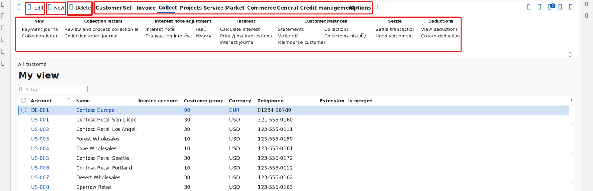

---
lab:
  title: 'التمرين المعملي 1.1: التنقل في تطبيقات التمويل والعمليات'
  module: 'Learning Path 1: Explore the core capabilities of Dynamics 365 finance and operations apps'
---

# مسار التعليم 1: استكشاف الإمكانات الأساسية لتطبيقات التمويل والعمليات من Dynamics 365
# وصف تطبيقات التمويل والعمليات

## التمرين المعملي 1.1: التنقل في تطبيقات التمويل والعمليات

## الهدف

الآن بعد أن أصبحت على دراية بتطبيقات التمويل والعمليات، خذ بعض الوقت لاستكشاف الواجهة.

## إعداد المعمل

- **الوقت المُتوقع**: 10 دقائق

## الإرشادات

### تسجيل الدخول إلى كمبيوتر المعمل

1.  سجل الدخول إلى كمبيوتر المعمل باستخدام بيانات الاعتماد أدناه:

    - اسم المستخدم: `Administrator`

    - كلمة مرور: `pass@word1`

1.  تم تكوين هذا التمرين المعملي لتوفير حساب المستخدم المسؤول تلقائيا. بمجرد الانتهاء، سيفتح Edge تلقائيا ويطالبك بتسجيل الدخول ويمكنك تسجيل الدخول باستخدام بيانات الاعتماد المتوفرة الموجودة ضمن علامة التبويب الموارد. إذا فشلت هذه العملية، يرجى مراجعة الملاحظة أدناه. وإلا يمكنك المضي قدما مع المختبر. 

    >على سطح المكتب، انقر نقرا مزدوجا فوق AdminUserProvisioning.
في حقل عنوان البريد الإلكتروني، أدخل اسم المستخدم من **الموارد** ثم انقر فوق إرسال.
انتظر المطالبة لتقديم المشورة للمستخدم المسؤول الذي تم تحديثه بنجاح إلى... ثم انقر فوق موافق.   

1.  سيفتح **Microsoft Edge** عنوان URL للتمويل والعمليات: <https://usnconeboxax1aos.cloud.onebox.dynamics.com>

1.  سجل الدخول باستخدام "Username" و"Password" المتوفرين في قائمة **Resources**. 

### التنقل في تطبيقات التمويل والعمليات

الآن بعد أن أصبحت على دراية بتطبيقات التمويل والعمليات، خذ بعض الوقت لاستكشاف الواجهات.

1.  في صفحة **تطبيقات التمويل والعمليات** الرئيسية، في حالة تكوينها، تجد ما يلي:

    - قائمة التنقل الموجودة على اليسار مطوية افتراضياً.

    - شعار شركتك.

    - تتوفر مربعات مساحة العمل لك بناءً على دورك في المؤسسة.

    - التقويم وعناصر العمل المخصصة لك.

    - شريط البحث المفيد للعثور بسرعة على ما تحتاج إليه.

    - في الجزء العلوي الأيمن، لديك الشركة التي تعمل معها حالياً والإخطارات والإعدادات وروابط المساعدة. التحقق من أن إدراج الشركة يكون **USMF**.

    
2.  في الجزء العلوي الأيسر، حدد القائمة على شكل هامبرجر **توسيع جزء التنقل**.

3.  جزء التنقل هو المكان الذي تجد فيه مجموعات **المفضلة** والعناصر **الحديثة** و**مساحات العمل** و**الوحدات**.

4.  في جزء التنقل، حدد **الوحدات** > **إدارة النظام**.

5.  قم بمراجعة المناطق المتاحة في وحدة إدارة النظام.

6.  ضمن **الإعداد**، حدد **خيارات أداء العميل**.

7.  في جزء **خيارات أداء العميل**، ضمن **تمكين وسائل شرح الميزات**، حدد مفتاح التبديل وتأكد من تعيينه إلى **نعم**.

8.  راجع الخيارات الأخرى المتاحة، وقم بالتمرير إلى أسفل الجزء، ثم حدد **موافق**.

9.  في الصفحة **الرئيسية**، في الجزء العلوي الأيسر، حدد رمز **الإعدادات**، ثم حدد **خيارات المستخدم**.

    

10. في صفحة **الخيارات**، استخدم علامات التبويب لتهيئة الإعدادات المختلفة التي يتم تطبيقها على حسابك.

11. حدد علامة التبويب **التفضيلات**.

12. راجع التفضيلات المتاحة. لاحظ أنه يمكنك تغيير الشركة الافتراضية وعرض الصفحة الأولي عند تسجيل الدخول.

13. حدد وراجع علامتي التبويب **الحساب** و**سير العمل**.

14. في قائمة التنقل اليمنى، حدد رمز **الصفحة الرئيسية**.

15. في الصفحة **الرئيسية**، في أعلى منتصف الصفحة، حدد المربع **البحث عن صفحة**.

16. في مربع البحث، ابحث **عن جميع العملاء**.

17. حدد **صفحة الحسابات المدينة** > **العملاء** > **جميع العملاء** . 

18. قد تحتاج إلى الانتظار أول مرة تبحث فيها عن صفحة. تدور دائرة صغيرة إلى يمين مربع البحث أثناء عملية البحث.

19. **صفحة** جميع العملاء هي مثال لصفحة قائمة. تحتوي صفحة القائمة بشكل عام على بيانات رئيسية يمكن قراءتها وإنشاؤها وحذفها وتحديثها. تتوفر المزيد من الميزات من الشريط أعلى القائمة.

    

20. قم بتمييز أحد العملاء من القائمة، وعلى اليمين، حدد **قائمة المعلومات** ذات الصلة، وراجع المعلومات المقدمة.

    

21. في **قائمة العملاء** ، حدد **Contoso Retail San Diego**.

22. **حدد قائمة المجموعة**، ثم حدد **عنوان عمود مجموعة** العملاء.

    

23. يتوفر في العديد من القوائم إمكانية الفرز والتصفية. استخدم عوامل التصفية لتحديد موقع محتوى الحقل الذي تبحث عنه بسرعة.

24. في الجزء العلوي الأيسر، لاحظ الوظيفة الإضافية. حرك الماوس إلى كل عنصر، وراجع وسيلة شرح الميزة. عند الانتهاء، حدد رمز **إغلاق** لإغلاق الصفحة والعودة إلى الصفحة **الرئيسية**.

    

