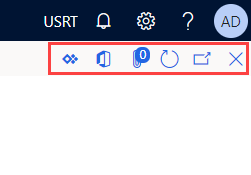

---
lab:
  title: 'تمرين معملي 1: التنقل في تطبيقات التمويل والعمليات'
  module: 'Module 1: Explore the core capabilities of Dynamics 365 finance and operations apps'
---

# الوحدة 1:استكشاف الإمكانات الأساسية لتطبيقات التمويل والعمليات من Dynamics 365

## تمرين معملي 1: التنقل في تطبيقات التمويل والعمليات

## الغرض

الآن بعد أن أصبحت على دراية بتطبيقات التمويل والعمليات، خذ بعض الوقت لاستكشاف الواجهة.

## إعداد المعمل

- **الوقت المقدر**: 10 دقائق

## الإرشادات

### تسجيل الدخول إلى كمبيوتر المعمل

1.  سجل الدخول إلى كمبيوتر المعمل باستخدام بيانات الاعتماد أدناه:

    - اسم المستخدم: `Administrator`

    - كلمة مرور: `pass@word1`

1.  انتظر حتى ينتهي البرنامج النصي AdminUserProvisioning قبل المتابعة. قد يستغرق هذا 2-3 دقائق. بمجرد اكتمال البرنامج النصي، سيتم عرض مربع منبثق لفترة وجيزة لتأكيد تحديث "Admin user" بنجاح. 

1.  سيفتح **Microsoft Edge** عنوان URL للتمويل والعمليات: <https://usnconeboxax1aos.cloud.onebox.dynamics.com>

1.  سجل الدخول باستخدام "Username" و"Password" المتوفرين في قائمة **Resources**. 

### التنقل في تطبيقات التمويل والعمليات

الآن بعد أن أصبحت على دراية بتطبيقات التمويل والعمليات، خذ بعض الوقت لاستكشاف الواجهات.

1.  في صفحة **تطبيقات التمويل والعمليات** الرئيسية، في حالة تكوينها، تجد ما يلي:

    - قائمة التنقل الموجودة على اليسار مطوية افتراضياً.

    - شعار شركتك.

    - تتوفر مربعات مساحة العمل لك بناءً على دورك في المؤسسة.

    - التقويم وعناصر العمل المخصصة لك.

    - شريط البحث مفيد جداً للعثور بسرعة على ما تحتاجه.

    - في الجزء العلوي الأيمن، لديك الشركة التي تعمل معها حالياً والإخطارات والإعدادات وروابط المساعدة. التحقق من أن إدراج الشركة يكون **USMF**.

    

2.  في الجزء العلوي الأيسر، حدد القائمة على شكل هامبرجر **توسيع جزء التنقل**.

3.  جزء التنقل هو المكان الذي تجد فيه مجموعات **المفضلة** والعناصر **الحديثة** و**مساحات العمل** و**الوحدات**.

4.  في جزء التنقل، حدد **الوحدات** > **إدارة النظام**.

5.  قم بمراجعة المناطق المتاحة في وحدة إدارة النظام.

6.  ضمن **الإعداد**، حدد **خيارات أداء العميل**.

7.  في جزء **خيارات أداء العميل**، ضمن **تمكين وسائل شرح الميزات**، حدد مفتاح التبديل وتأكد من تعيينه إلى **نعم**.

8.  راجع الخيارات الأخرى المتاحة، وقم بالتمرير إلى أسفل الجزء، ثم حدد **موافق**.

9.  في الصفحة **الرئيسية**، في الجزء العلوي الأيسر، حدد رمز **الإعدادات**، ثم حدد **خيارات المستخدم**.

    

10. في صفحة **الخيارات**، استخدم علامات التبويب لتهيئة الإعدادات المختلفة التي يتم تطبيقها على حسابك.

11. حدد علامة التبويب **التفضيلات**.

12. راجع التفضيلات المتاحة. لاحظ أنه يمكنك تغيير الشركة الافتراضية وعرض الصفحة الأولي عند تسجيل الدخول.

13. حدد وراجع علامتي التبويب **الحساب** و**سير العمل**.

14. في قائمة التنقل اليمنى، حدد رمز **الصفحة الرئيسية**.

15. في الصفحة **الرئيسية**، في أعلى منتصف الصفحة، حدد المربع **البحث عن صفحة**.

16. في مربع البحث، ابحث عن **كل الموردين**.

17. حدد **جميع الموردين** الحسابات الدائنة > الموردون

18. قد تحتاج إلى الانتظار أول مرة تبحث فيها عن صفحة. توجد دائرة صغيرة تدور على يمين مربع البحث أثناء معالجة البحث.

19. تعد صفحة **جميع الموردين** مثالاً على صفحة القائمة. تحتوي صفحة القائمة بشكل عام على بيانات رئيسية يمكن قراءتها وإنشاؤها وحذفها وتحديثها. توجد ميزات أخرى باستخدام الشريط الموجود أعلى القائمة.

    

20. قم بتمييز أحد الموردين من القائمة، وعلى اليسار، حدد قائمة **المعلومات ذات الصلة**، وراجع المعلومات الإضافية المتوفرة.

21. في قائمة الموردين، حدد **مستلزمات المكاتب من Acme**.

22. حدد قائمة **المجموعة**، ثم حدد عنوان العمود **مجموعة الموردين**.

    

23. يتوفر في العديد من القوائم إمكانية الفرز والتصفية. استخدم عوامل التصفية لتحديد موقع محتوى الحقل الذي تبحث عنه بسرعة.

24. في أعلى اليسار، لاحظ الوظائف الإضافية. حرك المؤشر فوق كل عنصر، وراجع وسيلة شرح الميزة. عند الانتهاء، حدد رمز **الرجوع** في الطرف الآخر من شريط الأدوات لإغلاق الصفحة والعودة إلى الصفحة السابقة.

    

25. في الجزء العلوي الأيسر، حدد **مساعدة** رمز علامة الاستفهام، ثم حدد **مساعدة**.

26. لاحظ أن معلومات المساعدة مرتبطة بالصفحة الحالية.

27. حاول تحديد مربع مساحة عمل، ثم قم بمراجعة معلومات التعليمات الخاصة بمساحة العمل هذه. عند الانتهاء، عد إلى الصفحة **الرئيسية**.

