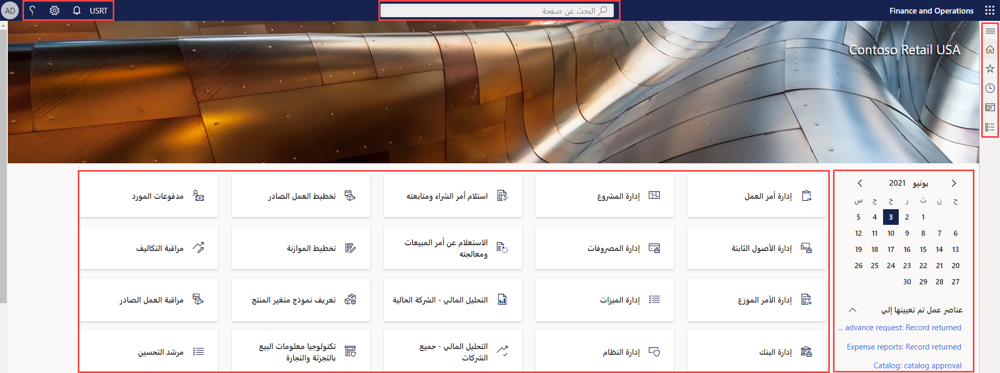
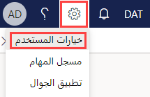
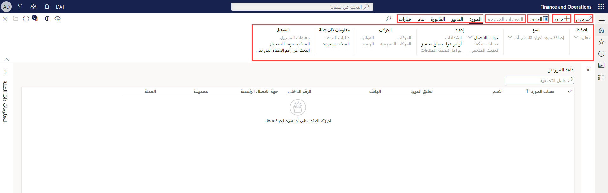



    <article class="markdown-body entry-content container-lg" itemprop="text"><table>
  <thead>
  <tr>
  <th>lab</th>
  </tr>
  </thead>
  <tbody>
  <tr>
  <td>
<table>
  <thead>
  <tr>
  <th>title</th>
  <th>module</th>
  </tr>
  </thead>
  <tbody>
  <tr>
  <td>
المعمل 1: تصفح تطبيقات Finance and Operations Apps
</td>
  <td>
الوحدة 1: تعرف على أساسيات Microsoft Dynamics 365 Supply Chain Management
</td>
  </tr>
  </tbody>
</table>

</td>
  </tr>
  </tbody>
</table>

# الوحدة 1: تعرف على أساسيات Microsoft Dynamics 365 - Supply Chain Management

## المعمل 1- تصفح تطبيقات Finance and Operations Apps

## الأهداف

الآن بعد أن أصبحت على دراية Finance and Operations Apps، استغرق بعض الوقت لاستكشاف الواجهة.

## إعداد المعمل

- **الزمن المقدر**: 10 دقائق

## الإرشادات

### سجّل الدخول إلى كمبيوتر المعمل

1. سجّل الدخول إلى كمبيوتر المعمل باستخدام بيانات الاعتماد أدناه

    - اسم المستخدم:

        لصق المحتوى

        Administrator

    - كلمة المرور:

        لصق المحتوى

        pass@word1

    > [! ملاحظة] قد يفتح Internet Explorer تلقائيًا في سطح المكتب. إذا لم تكن قد أكملت بالفعل الخطوات من 2 إلى 5، فالرجاء الانتهاء منها قبل العودة إلى Internet Explorer.

1. حدد ملف **AdminUserProvisioning** على سطح المكتب.

1. أدخل بيانات الاعتماد المقدمة ثم حدد **إرسال**.  
يمكن العثور على بيانات الاعتماد الخاصة بك في قائمة **الموارد** في الزاوية اليمنى العليا من الشاشة.

1. انتظر حتى ينتهي النص قبل المتابعة. قد يستغرق هذا 2-3 دقائق. بمجرد اكتمال البرنامج النصي، سيتم عرض مربع منبثق لتأكيد تحديث المستخدم المسؤول بنجاح.

1. حدد **موافق** للمتابعة.

1. افتح **Internet Explorer**.

1. تصفح إلى الرابط المحدد: <https://usnconeboxax1aos.cloud.onebox.dynamics.com>

1. سجّل الدخول باستخدام بيانات الاعتماد المتوفرة في قائمة **الموارد.**

### تصفح تطبيقات Finance and Operations Apps
1. في الصفحة الرئيسية لـ Finance and Operations، إذا تم تكوينها، سترى:

    - قائمة التنقل الموجودة على اليسار مطوية افتراضيًا.

    - شعار شركتك.

    - تتوفر مربعات مساحة العمل لك بناءً على دورك في المؤسسة.

    - التقويم وعناصر العمل المخصصة لك.

    - شريط البحث مفيد جدًا للعثور بسرعة على ما تحتاجه.

    - في الجزء العلوي الأيسر، لديك الشركة التي تعمل معها حاليًا والإخطارات والإعدادات وروابط المساعدة.  
    تحقق من أن الشركة المدرجة هي **USMF**.

    

1. في الجزء العلوي الأيسر، حدد القائمة على شكل هامبرجر **توسيع جزء التنقل**.

1. جزء التنقل هو المكان الذي ستجد فيه مجموعات **المفضلات** والعناصر **الحديثة** **ومساحات العمل** **والوحدات**.

1. في جزء التنقل، حدد **الوحدات**  >  **إدارة النظام**.

1. قم بمراجعة المناطق المتاحة في وحدة إدارة النظام.

1. ضمن **الإعداد**، حدد **خيارات أداء العميل**.

1. في جزء خيارات أداء العميل، ضمن **تمكين وسائل شرح الميزات**، حدد مفتاح التبديل وتأكد من تعيينه على **نعم**.

1. راجع الخيارات الأخرى المتاحة، وقم بالتمرير إلى أسفل الجزء، ثم حدد **موافق**.

1. في الصفحة الرئيسية، في الجزء العلوي الأيسر، حدد رمز الإعدادات، ثم حدد خيارات المستخدم.

    

1. في صفحة الخيارات، استخدم علامات التبويب لتكوين الإعدادات المختلفة التي سيتم تطبيقها على حسابك.

1. حدد علامة التبويب **التفضيلات**.

1. راجع التفضيلات المتاحة. لاحظ أنه يمكنك تغيير الشركة الافتراضية وعرض الصفحة الأولي الذي ستراه عند تسجيل الدخول.

1. حدد وراجع علامتي التبويب **الحساب** **وسير العمل.**

1. في قائمة التنقل اليمنى، حدد أيقونة **الصفحة الرئيسية.**

1. في الصفحة الرئيسية، في أعلى منتصف الصفحة، حدد مربع **البحث عن صفحة**.

1. في مربع البحث، ابحث عن **كل الموردين**.

1. قد تحتاج إلى الانتظار أول مرة تبحث فيها عن صفحة. سترى دائرة صغيرة تدور على يمين مربع البحث أثناء معالجة البحث.

1. تعد صفحة كل المورّدين مثالاً على صفحة قائمة. تحتوي صفحة القائمة بشكل عام على بيانات رئيسية يمكن قراءتها وإنشاؤها وحذفها وتحديثها. سترى ميزات إضافية باستخدام الشريط الموضح أعلى القائمة.

    

1. قم بتمييز أحد الموردين من القائمة، وعلى اليمين، حدد **قائمة المعلومات ذات الصلة**، وراجع المعلومات الإضافية المتوفرة.

1. في قائمة المورّدين، حدد **Acme Office Supplies**.

1. حدد قائمة **المجموعة**، ثم حدد عنوان عمود **مجموعة الموردين.**

    

1. يتوفر في العديد من القوائم إمكانية الفرز والتصفية. استخدم عوامل التصفية لتحديد موقع محتوى الحقل الذي تبحث عنه بسرعة.

1. في الجزء العلوي الأيمن، لاحظ الوظيفة الإضافية. حرك الماوس إلى كل عنصر، وراجع وسيلة شرح الميزة. عند الانتهاء، حدد أيقونة **إغلاق** لإغلاق الصفحة والعودة إلى الصفحة الرئيسية.

    

1. في الجزء العلوي الأيسر، حدد أيقونة علامة الاستفهام **التعليمات**، ثم حدد **التعليمات**.

1. لاحظ أن معلومات "التعليمات" مرتبطة بالصفحة الحالية.

1. حاول تحديد مربع مساحة عمل، ثم قم بمراجعة معلومات التعليمات الخاصة بمساحة العمل هذه. عند الانتهاء، عد إلى الصفحة الرئيسية.
