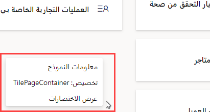
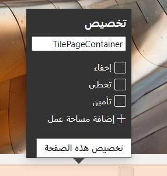
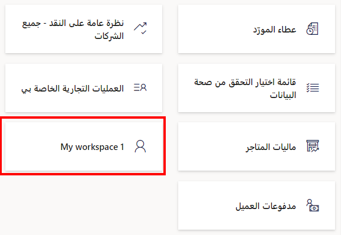
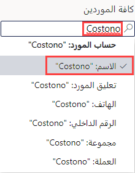
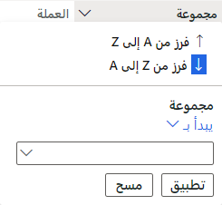
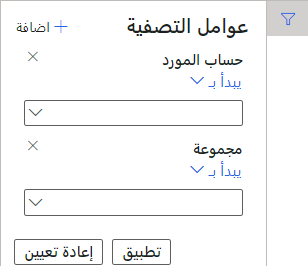
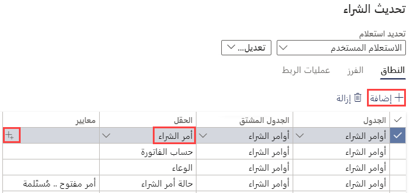
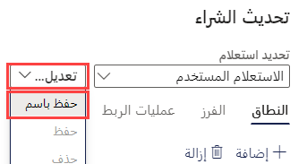

    <article class="markdown-body entry-content container-lg" itemprop="text"><table>
  <thead>
  <tr>
  <th>lab</th>
  </tr>
  </thead>
  <tbody>
  <tr>
  <td>
<table>
  <thead>
  <tr>
  <th>title</th>
  <th>module</th>
  </tr>
  </thead>
  <tbody>
  <tr>
  <td>
المعمل 2: استكشف مساحات العمل والتصفية
</td>
  <td>
الوحدة 1: تعرف على أساسيات Microsoft Dynamics 365 Supply Chain Management
</td>
  </tr>
  </tbody>
</table>

</td>
  </tr>
  </tbody>
</table>

# الوحدة 1: تعرف على أساسيات Microsoft Dynamics 365 - Supply Chain Management

## المعمل 2 - استكشف مساحات العمل والتصفية

## الأهداف

تتوفر لك العديد من مساحات العمل المضمنة عند تسجيل الدخول لأول مرة إلى Finance and Operations. يمكنك أيضًا إنشاء مساحة العمل الخاصة بك مع تركيز المحتوى على حاجة قد تكون لديك. تعد مساحات العمل إحدى الميزات العديدة في Dynamics 365، ولكن يجب أن تدرك أيضًا أن التصفية هي الطريقة للوصول حقًا إلى العناصر المحددة التي قد تبحث عنها. يجب عليك إنشاء مساحة عمل مخصصة جديدة واستخدام التصفية لتحديد العناصر المختلفة التي تحتاجها.

## إعداد المعمل

   - **الزمن المقدر**: 10 دقائق

## الإرشادات

1. في صفحة Finance and Operations الرئيسية، على يمين مربعات مساحة العمل، انقر بزر الماوس الأيمن أو اضغط مع الاستمرار في منطقة فارغة لتشغيل القائمة.

    

1. في القائمة، حدد **تخصيص: TilePageContainer**.

1. في نافذة التخصيص، حدد **+ إضافة مساحة عمل**.

1. إذا كانت نافذة التخصيص الصغيرة غير مرئية، فحاول التمرير لأعلى في الصفحة الرئيسية وانقر بزر الماوس الأيمن أو اضغط مع الاستمرار، ثم حدد **تخصيص: TilePageContainer** مرة أخرى.

    

1. في الصفحة الرئيسية، قم بالتمرير لأسفل وحدد موقع لوحة **مساحة العمل 1** الجديد.

    

1. انقر بزر الماوس الأيمن أو اضغط باستمرار على اللوحة، ثم حدد **تخصيص: مساحة العمل الخاصة بي 1**.

1. في نافذة التخصيص، أعد تسمية مساحة العمل 1 إلى **مساحة العمل الخاصة بي،** ثم حدد **تخصيص هذه الصفحة**.  
    سيتم حفظ تغيير الاسم تلقائيًا.

1. في شريط الأدوات المفتوح حديثًا، حدد **نقل**.

    

1. حدد لوحة **مساحة العمل الخاصة بي** ثم انقلها إلى موقع آخر على الصفحة الرئيسية.

    > [! ملاحظة] إذا كنت غير قادر على نقل اللوحة، فقم بتحديث الصفحة وأعد محاولة الخطوات السابقة لتحريك اللوحة.

1. أغلق شريط الأدوات.

1. في الصفحة الرئيسية، في مربع **البحث عن صفحة**، ابحث عن وحدد **كل المورّدين**.

1. في صفحة كل الموردين، في القائمة العلوية، حدد **خيارات**  >  **أضف إلى مساحة العمل**.

1. في مربع تصفية **مساحة العمل**، أدخل **مساحة العمل الخاصة بي،** ثم حدد مساحة العمل.

1. حدد قائمة العرض التقديمي، وراجع الخيارات المتاحة، ثم حدد **لوحة**.

1. عند الانتهاء، حدد **تكوين**.

1. في جزء إضافة كلوحة، تحقق من اسم اللوحة، ثم حدد **موافق**.

1. في قائمة التنقل اليمنى، حدد أيقونة **الصفحة الرئيسية**.

1. في الصفحة الرئيسية، حدد مساحة العمل الجديدة الخاصة بك.

1. في صفحة مساحة العمل الخاصة بي، تحقق من ظهور لوحة المورّدين المضافة حديثًا.

1. حدد لوحة **المورّدين**.

1. في صفحة كل الموردين، في المربع **تصفية**، أدخل **Contoso**.

1. راجع الحقول المختلفة التي يمكن استخدامها للعثور على Contoso.

    

1. حدد **الاسم: "Contoso"** ثم تحقق من نتائج التصفية.

1. امسح مربع التصفية، ثم اضغط على إدخال لإظهار كل المورّدين.

1. حدد عنوان العمود **المجموعة**.

    

1. يمكنك استخدام هذا لفرز المجموعات حسب الأقل إلى الأعلى (الفرز من أ إلى ي) أو من الأعلى إلى الأقل (الفرز من ي إلى أ).

1. ضمن **المجموعة**، حدد القائمة **تبدأ بـ** وراجع عوامل المقارنة. حدد **بالضبط**.

1. حدد القائمة أدناه **بالضبط،** ثم حدد **بائعون آخرون**.  
    بدلاً من ذلك، يمكنك إدخال قيمة في حقل القائمة.

1. حدد **تطبيق**، ثم قم بمراجعة النتائج. لاحظ أيقونة عامل التصفية في رأس عمود المجموعة.

    

1. حدد عمود **المجموعة**، ثم في قائمة التصفية، حدد **مسح**.

1. على يسار عنوان كل المورّدين، حدد أيقونة التصفية.

    

1. في الجزء العلوي الأيسر من جزء التصفية، حدد **+ إضافة**.

1. في جزء إضافة حقول عامل التصفية، حدد خانة الاختيار الموجودة على يسار **المجموعة،** ثم حدد تحديث.

1. لاحظ عامل التصفية الإضافي الذي تمت إضافته. سيسمح لك ذلك بتصفية القائمة بناءً على أكثر من معيار واحد.

    

1. في عامل التصفية **حساب المورّد يبدأ بـ**، حدد القائمة، ثم حدد **Northwind Traders**.

1. في عامل التصفية **المجموعة تبدأ بـ**، حدد القائمة، ثم حدد **30**.

1. حدد **تطبيق،** ثم قم بمراجعة نتائج التصفية.

1. في جزء عوامل التصفية، حدد **إعادة تعيين** ولاحظ أنه تمت إزالة عامل التصفية الإضافي وتمت إعادة تعيين عامل التصفية الافتراضي إلى قيمة فارغة.

1. في الشريط الشريطي، حدد **خيارات**، ثم في أقسام خيارات الصفحة، حدد **عامل التصفية أو الفرز المتقدم**.

    

1. في نافذة الاستعلام - الموردون، حدد **+ إضافة**.

1. في الصف الجديد، في خلية الحقل، حدد القائمة، ثم حدد **المجموعة**.

1. بدلاً من ذلك، يمكنك تحديد القائمة، والبدء في كتابة اسم المجموعة، ثم تحديدها من نتائج عامل التصفية.

1. في خلية المعايير، حدد أيقونة **الفتح.**

    

1. في قائمة مجموعة المورّدين، حدد **30** مورد آخر.

1. لحفظ الاستعلام الجديد، ضمن **تحديد استعلام**، حدد القائمة **تعديل**، ثم حدد **حفظ باسم**.

    

1. في جزء حفظ الاستعلام، في مربع **الاسم**، أدخل الاستعلام الخاص بي، ثم حدد **موافق**.

1. في صفحة الاستعلام - الموردون، حدد **موافق**.

1. تحقق من أن القائمة تعكس نتائج الاستعلام الذي تم إنشاؤه حديثًا.

1. لإزالة عامل التصفية، حدد **مرشح متقدم أو فرز**، ثم في صفحة الاستعلام - الموردون، حدد **إعادة تعيين** ثم حدد **موافق**.

1. سيؤدي هذا إلى إعادة تعيين الاستعلام ولكن لن يحذف استعلامك المحفوظ.
