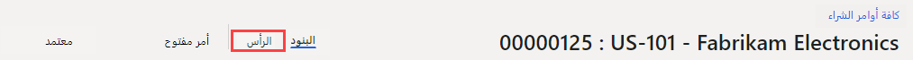
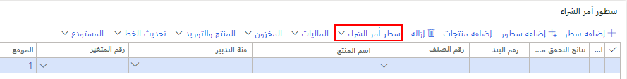

    <article class="markdown-body entry-content container-lg" itemprop="text"><table>
  <thead>
  <tr>
  <th>lab</th>
  </tr>
  </thead>
  <tbody>
  <tr>
  <td>
<table>
  <thead>
  <tr>
  <th>title</th>
  <th>module</th>
  </tr>
  </thead>
  <tbody>
  <tr>
  <td>
المعمل 4: إنشاء أمر شراء
</td>
  <td>
الوحدة 1: تعرف على أساسيات Microsoft Dynamics 365 Supply Chain Management
</td>
  </tr>
  </tbody>
</table>

</td>
  </tr>
  </tbody>
</table>

# الوحدة 1: تعرف على أساسيات Microsoft Dynamics 365 - Supply Chain Management

## المعمل 4 - إنشاء أمر شراء

## الأهداف

من المعتاد أن يتم إنشاء أوامر الشراء تلقائيًا كنتيجة للتخطيط الرئيسي والتسليم المباشر والعمليات الأخرى. عند إنشائه يدويًا، يتم عادةً إنشاء أمر الشراء بواسطة وكيل الشراء. قم بإنشاء أمر شراء باستخدام شركة USMF.

## إعداد المعمل

   - **الزمن المقدر**: 10 دقائق

## الإرشادات

1. في صفحة Finance and Operations الرئيسية، أعلى اليسار، تحقق من أنك تعمل مع شركة USMF.

1. إذا لزم الأمر، حدد الشركة، ومن القائمة، حدد **USMF**.

1. في الجزء العلوي الأيسر، حدد القائمة على شكل هامبرجر **توسيع جزء التنقل**.

1. حدد **الوحدات** >  **التدبير والتوريد** >  **أوامر الشراء** >  **كل أوامر الشراء**.

1. في صفحة كل أوامر الشراء، في القائمة العلوية، حدد **+ جديد**.

1. في جزء إنشاء أمر شراء، حدد قائمة **حساب المورد**، ثم حدد **US-101**.

1. عند تحديد مورّد، سيتم نسخ التفاصيل من سجل المورّد، مثل العنوان وحساب الفاتورة وشروط التسليم ووضع التسليم كقيم افتراضية في رأس الأمر. تستطيع تغيير هذه الإعدادات في أي وقت.

1. قم بتوسيع القسم **عام.**

1. ضمن **أبعاد التخزين**، حدد قائمة **الموقع**، وراجع قائمة المواقع.

1. يحدد حقل الموقع، جنبًا إلى جنب مع حقل المستودع، مكان تسليم البضائع أو الخدمات المشتراة. عنوان التسليم الافتراضي هو الموقع. يمكن ملء كلا الحقلين بقيم تم إعدادها للمورد المحدد، أو يمكنك تحديدها يدويًا.

1. ضمن **التواريخ**، يتم استخدام حقل تاريخ التسليم لتحديد وقت الحاجة إلى تسليم البضائع والخدمات المشتراة.

1. يمكنك تحديد تاريخ تسليم واحد للأمر، أو يمكن إعطاء سطور الأمر الفردية تواريخ تسليم فريدة. إذا كان تاريخ التسليم المحدد هنا لا يمكن الوفاء به لمنتجات أو خدمات معينة لأن لها فترات زمنية أطول، فسيتم إنشاء هذه البنود بتاريخ تسليم لاحق لاستيعاب ذلك.

1. قم بتوسيع قسم **الإدارة.** يمكن استخدام مربع **منشئ الأمر** لتحديد من يقوم بتقديم الطلب.

1. قد يكون هذا مناسبًا لمشاركته مع المورّد في حالة الحاجة إلى الاتصال بهذا الشخص. قد يتم تعيين القيمة تلقائيًا إذا كان حساب المستخدم الحالي مرتبطًا باسم على صفحة المستخدمين.

1. حدد **موافق**.

1. تم الآن إنشاء رأس الطلب. عندما تعمل مع سطور أمر الشراء، يتم عرض ملخص لمعلومات الرأس فقط. إذا كنت بحاجة إلى عرض بقية المعلومات، فحدد **الرأس**.

    

1. ضمن **سطور أمر الشراء**، في القائمة، حدد **سطر أمر الشراء**.

    

1. ضمن **العرض**، حدد **الأبعاد**.

1. يمكن أن تكون المنتجات في متغيرات يتم تمييزها حسب الأبعاد، مثل اللون أو الحجم أو النمط. يمكن أيضًا إعداد المنتجات لاستخدام أبعاد التخزين، مثل الموقع والمستودع. هناك أيضًا أبعاد تعقب اختيارية، مثل الأرقام التسلسلية والدُفعات. لتحسين كفاءة إدخال الأمر، يمكنك إضافة حقول الأبعاد التي تستخدمها بشكل شائع مباشرةً إلى شبكة الأمر.

1. في جزء عرض الأبعاد، ضمن **أبعاد المنتج**، حدد خانة الاختيار **اللون.**

1. اختياري: إذا حددت مفتاح تبديل حفظ الإعداد، فسيتم أيضًا عرض الأبعاد التي اخترتها على شبكة سطر الأمر في المرة التالية التي تفتح فيها صفحة أمر الشراء.

1. حدد **موافق**.

1. حدد قائمة الخلية **رقم العنصر**، ثم حدد **T0004**.

1. تذكر أنه يمكنك أيضًا الكتابة في مربع التصفية بدلاً من التمرير عبر القائمة.

1. يتم إنشاء بنود الأمر للمنتجات والخدمات عن طريق تحديد رقم عنصر أو كمصروفات عن طريق تحديد فئة تدبير.

1. تُستخدم فئة التدبير لإضافة البنود حيث يتم إنفاق العناصر المشتراة كمصروفات مباشرة، بدلاً من الدخول في المخزون. هذا يعني أنه إذا كنت بحاجة إلى إنفاق عملية شراء، فيمكنك القيام بذلك عن طريق إنشاء بند أمر شراء يحدد فئة تدبير، بدلاً من إنشاء سطر برقم عنصر. يمكن أيضًا ربط العناصر بفئة تدبير وفي هذه الحالة، يتم عرض فئة التدبير كمعلومات فقط.

1. حدد **قائمة الألوان**، وراجع الخيارات المتاحة، ثم حدد أحد الألوان أو مجموعات الألوان.

1. عادةً ما يتم ملء الموقع والمستودع بقيم من رأس الأمر، ولكن من الممكن تجاوز الحقول إذا كانت هناك حاجة لتسليم بعض السطور إلى مواقع مختلفة.

1. في مربع **الكمية**، أدخل **10**.

1. يتم ملء الكمية تلقائيًا بالحد الأدنى لكمية الطلب للمنتج إذا تم إعداده، أو بالقيمة 1.

1. بعض المعلومات الإضافية:

    - **الوحدة**: يشير إلى وحدة القياس للكمية المطلوبة. عادة، يتم توفير الوحدة تلقائيًا من وحدة الشراء على البيانات الرئيسية للمنتج.

    - **سعر الوحدة**: يحتوي على قيمة إما من اتفاقية شراء أو اتفاقية تجارية. من الممكن تغيير سعر الوحدة في سطور الأمر الفردية - على سبيل المثال، إذا تم التفاوض على سعر فريد مع المورّد.

    - **الخصم**: يمثل مبلغ الخصم لكل وحدة. وبالتالي، فإن هذا الخصم يقلل من سعر الوحدة بالخصم. عادةً ما يتم توفير هذا الخصم تلقائيًا من اتفاقيات الشراء أو الاتفاقيات التجارية، ولكن من الممكن تجاوز السطور الفردية إذا تم التفاوض على خصومات فريدة مع المورّد.

    - **نسبة الخصم**: عند إدخالها، يؤدي ذلك إلى تقليل المبلغ الصافي للسطر وفقًا لذلك. غالبًا ما يتم توفير نسبة الخصم تلقائيًا من اتفاقيات الشراء أو اتفاقيات التجارة، ولكن من الممكن تجاوز السطور الفردية إذا تم التفاوض على نسبة خصم فريدة مع المورّد.

    - **المبلغ الصافي**: محسوبة من الحقول الأخرى في البند، بما في ذلك الكمية وسعر الوحدة والخصم ونسبة الخصم. من الممكن تغيير صافي المبلغ، ولكن ستكون حقول سعر الوحدة والخصم والنسبة المئوية للخصم فارغة، وعندما تقوم بالترحيل باتجاه السطر، سيكون المبلغ الذي تم ترحيله متناسبًا مع المبلغ الصافي. بشكل عام، يتم استخدام حقل المبلغ الصافي فقط لعرض المبلغ الصافي للسطر.

1. أسفل سطور أمر الشراء، في أسفل الصفحة، حدد **تفاصيل السطر**.

1. حدد علامة التبويب **التسليم**.

1. يمكن تعيين تاريخ تسليم فريد لكل سطر أمر. التاريخ موروث من الحقل الموجود في رأس أمر الشراء، ولكن يمكنك تغيير ذلك.

1. أغلق صفحة سطر أمر الشراء.

1. في صفحة جميع أوامر الشراء، استخدم ميزة التصفية وابحث عن أمر الشراء الجديد.

1. عند الانتهاء، أغلق صفحة جميع أوامر الشراء وعد إلى الصفحة الرئيسية.
