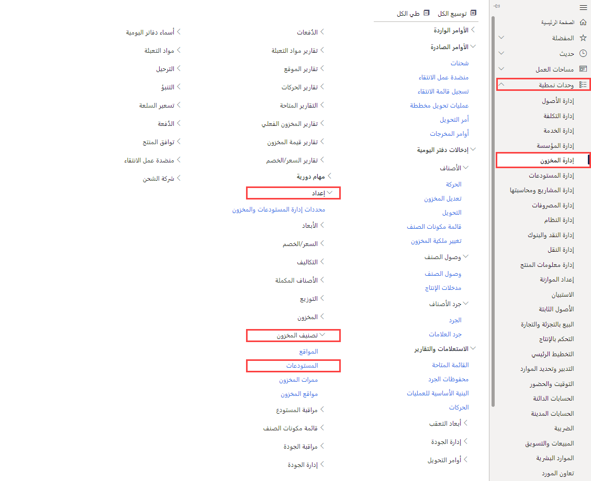

    <article class="markdown-body entry-content container-lg" itemprop="text"><table>
  <thead>
  <tr>
  <th>lab</th>
  </tr>
  </thead>
  <tbody>
  <tr>
  <td>
<table>
  <thead>
  <tr>
  <th>title</th>
  <th>module</th>
  </tr>
  </thead>
  <tbody>
  <tr>
  <td>
المعمل 5: إنشاء مستودع
</td>
  <td>
الوحدة 1: تعرف على أساسيات Microsoft Dynamics 365 Supply Chain Management
</td>
  </tr>
  </tbody>
</table>

</td>
  </tr>
  </tbody>
</table>

# الوحدة 1: تعرف على أساسيات Microsoft Dynamics 365 - Supply Chain Management

## المعمل 5 - إنشاء مستودع

## الأهداف
يمنحك نظام إدارة المستودعات في Supply Chain Management طرقًا مرنة لتحديد تخطيط المستودع الخاص بك لتلبية الاحتياجات المتغيرة، بحيث يمكنك تحقيق الكفاءة المثلى للمستودع.

- يمكنك إنشاء مناطق تخزين ذات أولوية عالية ومنخفضة الأولوية لوضع البضائع على النحو الأمثل.
- يمكنك تقسيم المستودع الخاص بك إلى مناطق لتلبية احتياجات التخزين المختلفة، مثل متطلبات درجة الحرارة، أو معدلات الدوران المختلفة للعناصر.
- يمكنك تحديد مواقع المستودعات على أي مستوى (على سبيل المثال، الموقع والمستودع والممر والحامل والرف وموضع الصندوق).
- يمكنك تجميع المواقع باستخدام إعدادات قيود السعة المادية.
- يمكنك التحكم في كيفية تخزين العناصر وانتقاءها، استنادًا إلى القواعد المحددة بواسطة الاستعلام.

لاستخدام إدارة المستودعات في Supply Chain Management، يجب عليك إنشاء مستودع وتمكينه لأنشطة إدارة المستودعات الأكثر تقدمًا أو تخصصًا.

## إعداد المعمل

   - **الزمن المقدر**: 10 دقائق

## الإرشادات

1. في صفحة Finance and Operations الرئيسية، أعلى اليسار، تحقق من أنك تعمل مع شركة USMF.

1. إذا لزم الأمر، حدد الشركة، ومن القائمة، حدد **USMF**.

1. في جزء التنقل الأيمن، حدد **الوحدات** >  **إدارة المخزون** >  **الإعداد** >  **تصنيف المخزون** >  **المستودعات**.

    

1. في صفحة المستودعات، في القائمة العلوية، حدد **جديد**.

1. في **حقل المستودع**، أدخل **101**.

1. في **حقل الاسم**، أدخل **مستودع التجاوز**.

1. حدد قائمة **الموقع**، ثم حدد **3 إنتاج رغوة منزلية**.

1. قم بتوسيع **أسماء المواقع**.  
    تحدد الخيارات الموجودة في هذا القسم التنسيق الافتراضي لأسماء المواقع.

1. اضبط خياري **تضمين الممر** **وتضمين الحامل** على **نعم**.

1. في مربع **التنسيق**، للحامل، أدخل قيمة.  
    على سبيل المثال، إذا كان يجب أن يحتوي تنسيق اسم موقع الحامل على OVFL، فيمكنك إدخال هذه القيمة في مربع التنسيق.

1. ضمن **المستوى**، اضبط خيار **تضمين الرف** على **نعم**.

1. في **حقل التنسيق**، للرف، أدخل **- ##**.

1. في القائمة العلوية، حدد **المستودع**.

    

1. ضمن **الاحتفاظ**، حدد **معالج المواقع**.

1. في صفحة الترحيب، راجع المعلومات ثم في الزاوية اليمنى السفلية، حدد **التالي**.

1. قم بإلغاء تحديد مربعات الاختيار **المساحات الخارجية** و**مواقع الكميات الكبيرة.**

1. حدد **التالي** وراجع المعلومات.

1. تابع إلى كل صفحة ثم، عند الانتهاء، حدد **إنهاء**.

1. أغلق الصفحة وارجع إلى الصفحة الرئيسية.
