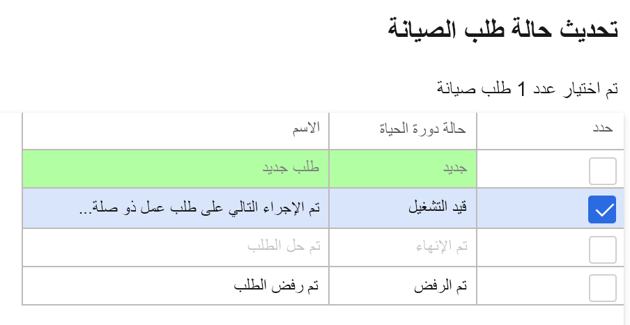
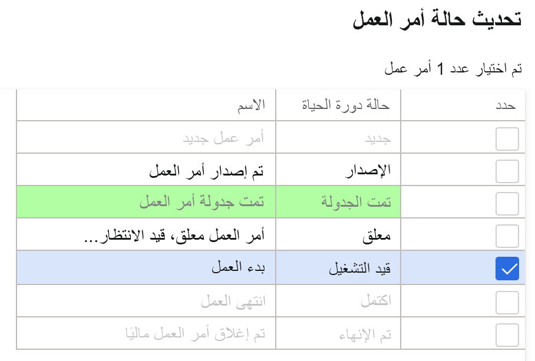
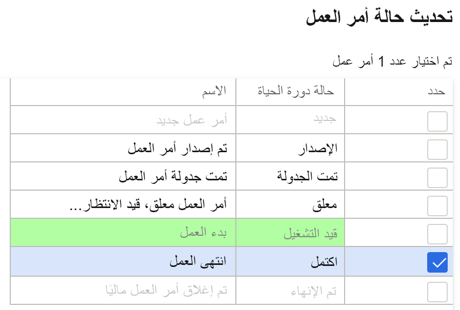

    <article class="markdown-body entry-content container-lg" itemprop="text"><table>
  <thead>
  <tr>
  <th>lab</th>
  </tr>
  </thead>
  <tbody>
  <tr>
  <td>
<table>
  <thead>
  <tr>
  <th>title</th>
  <th>module</th>
  </tr>
  </thead>
  <tbody>
  <tr>
  <td>
النشاط المعملي 7: إنشاء أمر عمل صيانة
</td>
  <td>
الوحدة 1: تعرف على أساسيات Microsoft Dynamics 365 Supply Chain Management
</td>
  </tr>
  </tbody>
</table>

</td>
  </tr>
  </tbody>
</table>

## النشاط المعملي 7 - إنشاء أمر عمل صيانة

**الأهداف**

تصف أوامر الصيانة الموضوعة في النظام أعمال الصيانة أو الإصلاح المطلوبة للأصل وتستخدم لتعيين الموارد المناسبة لإكمال طلب الصيانة. يتم إنشاء أمر العمل بناءً على أمر الصيانة، والذي يتم تنفيذه بواسطة المورد المخصص.

**إعداد المعمل**

الزمن المقدر: 15 دقيقة

**الإرشادات**

1. في صفحة Finance and Operations الرئيسية، أعلى اليسار، تحقق من أنك تعمل مع شركة USMF.

2. إذا لزم الأمر، حدد الشركة ومن القائمة، حدد **USMF**.

3. في جزء التنقل الأيمن، حدد **الوحدات** **&gt; إدارة الأصول &gt; الإعداد &gt; طلب صيانة &gt; حالات دورة الحياة.**

4. حدد "قيد التقدم"، وانقر الزر **تحرير** في جزء التنقل.

5. ضمن علامة التبويب **عام**، غيِّر قيمة **إنشاء أمر العمل** إلى نعم.

6. في جزء التنقل الأيسر، حدد **الوحدات**** &gt; إدارة الأصول &gt; مساحات العمل &gt; إدارة طلبات الصيانة.**

7. انقر فوق **إنشاء طلب صيانة**.

8. أدخل القيم التالية في حقول مربع الحوار، وانقر على زر **موافق**.

	- نوع طلب الصيانة: تصحيحي

	- الوصف: ضوضاء في كاشف المعادن

	- موقع العمل: PP-02-02

	- الأصل: MD-201

	- مستوى الخدمة: 4

	- عرض الخطأ: ضوضاء شديدة

	- مجال الخطأ: كهربائي 

9. أغلق نموذج **طلب الصيانة** وارجع إلى مساحة عمل **إدارة طلبات الصيانة**.

10. حدِّث الصفحة بالضغط على أيقونة **تحديث** في الزاوية اليمنى العليا من الشاشة.

11. سيظهر طلب الصيانة الجديد في قائمة طلبات الصيانة بدون أمر عمل.

12. حدد طلب الصيانة الذي تم إنشاؤه حديثًا وانقر على زر **تحديث حالة طلب الصيانة**. 

13. في مربع الحوار، حدد مربع الاختيار بجوار "قيد التقدم" وانقر على **موافق**

 

14. حدد طلب الصيانة الذي تم إنشاؤه حديثًا وانقر على زر **إنشاء أمر عمل**. 

15. أدخل القيم التالية في حقول مربع الحوار، وانقر على زر **موافق**.

	- نوع مهمة الصيانة: فحص

16. سيتم إنشاء أمر عمل جديد، وسيتم تحديث أمر العمل في سجل طلب الصيانة المحدد.

17. انقر فوق أمر العمل وانتقل إلى شاشة **تفاصيل أمر العمل**.

18. ضمن سطور أمر العمل، انقر فوق الزر **إرسال**.

19. أدخل القيم التالية في حقول مربع الحوار، وانقر على زر **موافق**.

	- عامل: تيد هوارد

20. في قائمة الإجراء، انتقل إلى **أمر العمل &gt; حالة دورة الحياة &gt; تحديث حالة أمر العمل.**

21. في مربع الحوار، حدد مربع الاختيار بجوار "قيد التقدم" وانقر على **موافق**

22. حدد تاريخ ووقت **البدء الفعلي** في مربع الحوار وانقر فوق **موافق**.

23. من قائمة إجراء أمر العمل، انتقل مرة أخرى إلى **أمر العمل &gt; حالة دورة الحياة &gt; تحديث حالة أمر العمل.**

24. في مربع الحوار، حدد مربع الاختيار بجوار "مكتمل" وانقر على **موافق**

25. في حقل **الانتهاء الفعلي**، حدد تاريخًا ووقتًا أكبر من تاريخ ووقت البدء وانقر فوق "موافق"

26. ستجد حالة دورة الحياة الحالية في رأس أمر العمل على أنها مكتملة.
