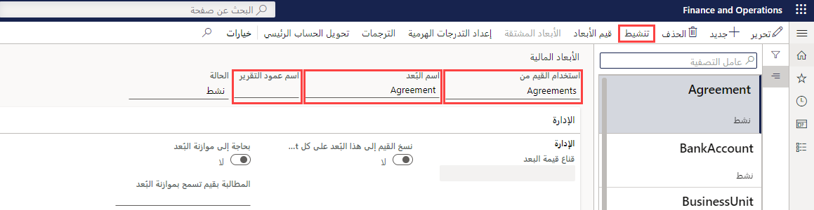

    <article class="markdown-body entry-content container-lg" itemprop="text"><table>
  <thead>
  <tr>
  <th>lab</th>
  </tr>
  </thead>
  <tbody>
  <tr>
  <td>
<table>
  <thead>
  <tr>
  <th>title</th>
  <th>module</th>
  </tr>
  </thead>
  <tbody>
  <tr>
  <td>
المعمل 1: إنشاء بُعد مالي
</td>
  <td>
الوحدة 2: تعرف على أساسيات Microsoft Dynamics 365 Finance
</td>
  </tr>
  </tbody>
</table>

</td>
  </tr>
  </tbody>
</table>

## المعمل 1 - إنشاء بُعد مالي

## الأهداف

استخدم صفحة الأبعاد المالية لإنشاء أبعاد مالية يمكنك استخدامها كشرائح حساب لمخططات الحسابات. هناك نوعان من الأبعاد المالية: الأبعاد المخصصة والأبعاد المدعومة من الكيان. تتم مشاركة الأبعاد المخصصة عبر الكيانات القانونية، ويتم إدخال القيم والاحتفاظ بها من قبل المستخدمين. بالنسبة للأبعاد المدعومة من الكيان، يتم تحديد القيم في مكان آخر في النظام، مثل كيانات العملاء أو المتاجر. تتم مشاركة بعض الأبعاد المدعومة من قبل الكيان عبر الكيانات القانونية، في حين أن الأبعاد الأخرى المدعومة من قبل الكيان تكون خاصة بالشركة.

يجب عليك إنشاء بُعد مالي مخصص ستستخدمه شركتك.

## إعداد المعمل

   - **الزمن المقدر**: 5 دقائق

## الإرشادات

1. في صفحة Finance and Operations الرئيسية، أعلى اليسار، تحقق من أنك تعمل مع شركة USMF.

1. إذا لزم الأمر، حدد الشركة، ومن القائمة، حدد **USMF**.

1. في جزء التنقل الأيمن، حدد **الوحدات**  >  **دفتر الأستاذ العام**  >  **جدول الحسابات**  >  **الأبعاد**  >  **الأبعاد المالية**.

1. في القائمة العلوية، حدد **+ جديد**.

1. في صفحة الأبعاد المالية، حدد قائمة **استخدام القيم من**، ثم حدد **<بُعد مخصص>**.

1. في مربع اسم **البعد**، أدخل **Affliate_Revenue**.

1. في مربع **اسم عمود التقرير**، أدخل **Afflt**.

1. في القائمة العلوية، حدد **تنشيط**.

    

1. راجع المعلومات الموجودة في مربع الحوار، ثم حدد **إغلاق**.

1. راجع رسالة الإعلام التحذيرية.

    

    >[ [ملاحظة] يمكن تشغيل وضع الصيانة وإيقافه مباشرةً من خلال Lifecycle Services (LCS) في آلية تحديد الوصول وبيئات الإنتاج. يمكن العثور على مزيدٍ من المعلومات عن إدارة خدمات دورة الحياة على الرابط التالي [https://docs.microsoft.com/ar-sa/dynamics365/fin-ops-core/dev-itpro/deployment/maintenanceoperationsguide-newinfrastructure](https://docs.microsoft.com/ar-sa/dynamics365/fin-ops-core/dev-itpro/deployment/maintenanceoperationsguide-newinfrastructure).
