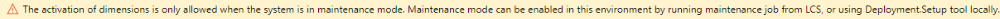

---
lab:
  title: 'النشاط المعملي 1: إنشاء بُعد مالي'
  module: 'Module 2: Learn the Fundamentals of Microsoft Dynamics 365 Finance'
ms.openlocfilehash: 9bbc1a92cb719b988ddfa6a08e1e3b2d8c69976e
ms.sourcegitcommit: 252458fca8e71b6e5e8b99ae4c2b47cd85461a30
ms.translationtype: HT
ms.contentlocale: ar-SA
ms.lasthandoff: 01/27/2022
ms.locfileid: "137909252"
---
## المعمل 1 - إنشاء بُعد مالي

## الأهداف

استخدم صفحة الأبعاد المالية لإنشاء أبعاد مالية يمكنك استخدامها كشرائح حساب لمخططات الحسابات. هناك نوعان من الأبعاد المالية: الأبعاد المخصصة والأبعاد المدعومة من الكيان. تتم مشاركة الأبعاد المخصصة عبر الكيانات القانونية، ويتم إدخال القيم والاحتفاظ بها من قبل المستخدمين. بالنسبة للأبعاد المدعومة من الكيان، يتم تحديد القيم في مكان آخر في النظام، مثل كيانات العملاء أو المتاجر. تتم مشاركة بعض الأبعاد المدعومة من قبل الكيان عبر الكيانات القانونية، في حين أن الأبعاد الأخرى المدعومة من قبل الكيان تكون خاصة بالشركة.

يجب عليك إنشاء بُعد مالي مخصص ستستخدمه شركتك.

## إعداد النشاط المعملي

   - **الزمن المقدر**: 5 minutes

## الإرشادات

1. في صفحة Finance and Operations الرئيسية، أعلى اليسار، تحقق من أنك تعمل مع شركة USMF.

1. إذا لزم الأمر، حدد الشركة، ومن القائمة، حدد **USMF**.

1. في جزء التنقل الأيسر، حدد **Modules** > **General ledger** > **Chart of accounts** > **Dimensions** > **Financial dimensions**.

1. في القائمة العلوية، حدد **+ جديد**.

1. في صفحة الأبعاد المالية، حدد قائمة **استخدام القيم من**، ثم حدد **<بُعد مخصص>** .

1. في مربع اسم **البعد**، أدخل **Affliate_Revenue**.

1. في مربع **اسم عمود التقرير**، أدخل **Afflt**.

1. في القائمة العلوية، حدد **تنشيط**.

    

1. راجع المعلومات الموجودة في مربع الحوار، ثم حدد **إغلاق**.

1. راجع رسالة الإعلام التحذيرية.

    

    >[!NOTE] يمكن تشغيل وضع الصيانة وإيقاف تشغيله مباشرة من خلال خدمات دورة الحياة (LCS) على بيئة الاختبار المعزولة وبيئات الإنتاج. يمكن العثور على مزيد من المعلومات حول إدارة خدمات دورة الحياة في [https://docs.microsoft.com/en-us/dynamics365/fin-ops-core/dev-itpro/deployment/maintenanceoperationsguide-newinfrastructure](https://docs.microsoft.com/en-us/dynamics365/fin-ops-core/dev-itpro/deployment/maintenanceoperationsguide-newinfrastructure).
