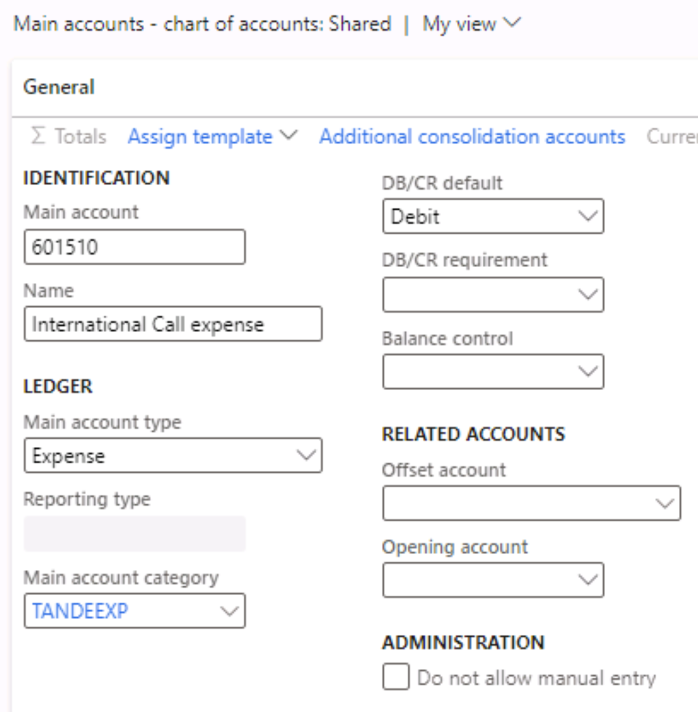

---
lab:
  title: 'النشاط المعملي 1: إنشاء حساب رئيسي'
  module: 'Module 2: Learn the Fundamentals of Microsoft Dynamics 365 Finance'
---

# الوحدة الثانية: تعرف على أساسيات Microsoft Dynamics 365 Finance

## النشاط المعملي 1: إنشاء حساب رئيسي

## إعداد النشاط المعملي

   - **الزمن المقدر**: 5 minutes

## الإرشادات

1.  في الصفحة **الرئيسية للتمويل والعمليات** ، في أعلى اليمين، تحقق من أنك تعمل مع شركة **USMF** .

2.  إذا لزم الأمر، حدد الشركة، ومن القائمة، حدد **USMF**.

3.  باستخدام جزء التنقّل، حدد **Modules** > **General ledger** > **Chart of accounts** > **Accounts** > **Main accounts**.

4.  في جزء الإجراءات، حدد **+ جديد**.

5.  أدخل القيم التالية في صفحة **الحساب الرئيسي** :

    - Main account: **601510**

    - الاسم: **مصروفات المكالمات الدولية**

    - نوع المصروفات الرئيسي: **Expense**

    - فئة الحساب الرئيسي: **TANDEEXP**

    - بطاقة الخصم/بطاقة الائتمان الافتراضية: **Debit**

    

6.  انتقل إلى **Modules &gt; General ledger &gt; Journal entries &gt; General journals.**

7.  في جزء الإجراءات، حدد **+ جديد**.

8.  أدخل القيمة التالية في صفحة **دفاتر اليومية العامة** وحدد **خطوط** في جزء الإجراء:

    - الاسم: GenJrn

9.  أدخل القيم التالية في صفحة **قسيمة دفتر اليومية** :

    - نوع الحساب: **دفتر الأستاذ**

    - Main account: **601510**

    - الخصم: **10.00** 

    - نوع حساب الإزاحة: **دفتر الأستاذ**

    - رقم حساب **الإزاحة: 110180** 

10. حدد الزر **Save** في جزء الإجراءات.

11. حدد **التحقق من صحة &gt; ترحيل المحاكاة**. 

12. حدد الزر **Post** في جزء الإجراءات. يجب نشر دفتر اليومية.
