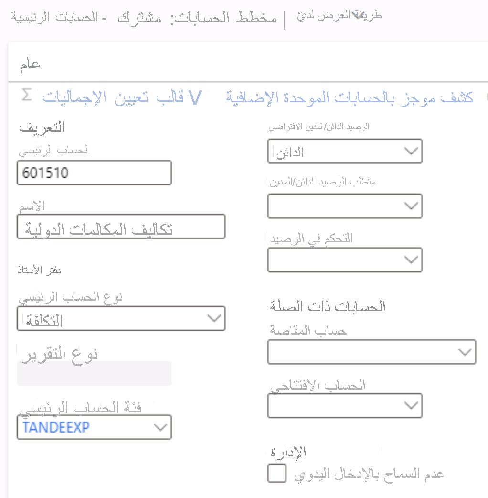

---
lab:
  title: 'النشاط المعملي 1: إنشاء حساب رئيسي'
  module: 'Module 2: Learn the Fundamentals of Microsoft Dynamics 365 Finance'
---
    
# الوحدة الثانية: تعرف على أساسيات Microsoft Dynamics 365 Finance
    
## النشاط المعملي 1 إنشاء حساب رئيسي

## الإرشادات

1. في صفحة **Finance and Operations Home**، أعلى اليمين، تحقق من أنك تعمل مع شركة USMF.

2. إذا لزم الأمر، حدد الشركة، ومن القائمة، حدد **USMF**.

3. باستخدام جزء التنقّل، حدد **Modules** > **General ledger** > **Chart of accounts** > **Accounts** > **Main accounts**.

4. في القائمة العلوية، حدد **+ جديد**.

5. أدخل القيم التالية في صفحة Main account:

    - Main account: **601510**

    - الاسم: **مصروفات المكالمات الدولية**

    - نوع المصروفات الرئيسي: **Expense**

    - فئة الحساب الرئيسي: **TANDEEXP**

    - بطاقة الخصم/بطاقة الائتمان الافتراضية: **Debit**

 
