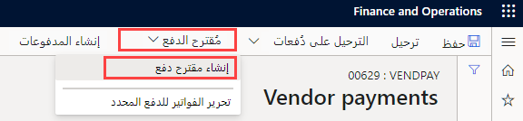
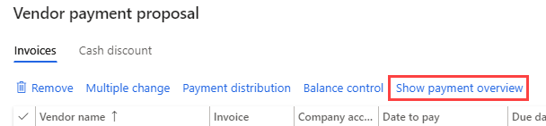

    <article class="markdown-body entry-content container-lg" itemprop="text"><table>
  <thead>
  <tr>
  <th>lab</th>
  </tr>
  </thead>
  <tbody>
  <tr>
  <td>
<table>
  <thead>
  <tr>
  <th>title</th>
  <th>module</th>
  </tr>
  </thead>
  <tbody>
  <tr>
  <td>
المعمل 2: إنشاء دفتر يومية الدفع للمورّد
</td>
  <td>
الوحدة 2: تعرف على أساسيات Microsoft Dynamics 365 Finance
</td>
  </tr>
  </tbody>
</table>

</td>
  </tr>
  </tbody>
</table>

## المعمل 2 - إنشاء دفتر يومية الدفع للمورّد

## الأهداف

يمكن الآن للمؤسسات التي تدفع للمورّدين وفقًا لجدول متكرر أتمتة عملية إنشاء مقترحات الدفع للموردين. وتحدد أتمتة مقترحات الدفع للموردين التفاصيل التالية:

- عندما يتم تشغيل مقترحات الدفع
- ما المعايير المستخدمة لتحديد الفواتير التي ينبغي دفعها
- ما دفتر يومية الدفع الخاص بالمورّد الذي يتم حفظ المدفوعات الناتجة فيه

لا تقوم عمليات أتمتة مقترح الدفع بنشر المدفوعات تلقائيًا. لذا، يمكنك مواصلة استخدام أي عمليات للتحقق من الصحة وسير العمل تستخدمها حاليًا للموافقة على المدفوعات التي تم إنشاؤها.

إنشاء إدخال دفتر يومية دفع جديد للمورد ومقترح دفع.

## إعداد المعمل

   - **الزمن المقدر**: 10 دقائق

## الإرشادات

1. في صفحة Finance and Operations الرئيسية، أعلى اليسار، تحقق من أنك تعمل مع شركة USMF.

1. إذا لزم الأمر، حدد الشركة ومن القائمة، حدد **USMF**.

1. في جزء التنقل الأيسر، حدد **الوحدات**  >  **الحسابات القابلة للدفع**  >  **المدفوعات**  >  **دفتر يومية الدفع للمورّد**.

1. في القائمة العلوية، حدد **+ جديد**.

1. لاحظ رقم دُفعة دفتر اليومية الجديد الذي تم إنشاؤه.

1. في مربع **الاسم**، أدخل **Vend،** ثم حدد **VendPay** من القائمة المصفاة.

1. في القائمة العلوية، حدد **السطور**.

1. في صفحة مدفوعات المورّدين، في القائمة العلوية، حدد **مقترح الدفع**  >  **إنشاء مقترح دفع**.  
    مقترح الدفع هو استعلام يُستخدم لتحديد فواتير للدفع. يمكنك تحرير قائمة الفواتير للدفع قبل إنشاء أو إجراء مدفوعات المورّدين.

    

1. في جزء مقترح دفع المورّد، ضمن **معايير تحديد الفاتورة**، حدد قائمة **تحديد الفواتير حسب**، وراجع الخيارات المتاحة، ثم حدد **تاريخ الاستحقاق**.

1. في **من تاريخ** و**إلى تاريخ**، احذف أي قيمة موجودة. بالنسبة لهذا التمرين، سيتم ترك نطاقات التواريخ هذه فارغة.

    > [ملاحظة] يمكن استخدام تاريخ الحد الأدنى للدفع كتاريخ دفع. سيكون الحد الأدنى لتاريخ الدفع هو أقرب تاريخ يتم استخدامه عند إنشاء المدفوعات. على سبيل المثال، إذا كان للفاتورة تاريخ استحقاق بعد الحد الأدنى لتاريخ الدفع، فسيصبح تاريخ الاستحقاق هو تاريخ الدفع بدلاً من الحد الأدنى لتاريخ الدفع لدفع الفاتورة في آخر تاريخ ممكن.

1. قم بتوسيع **السجلات لتضمينها** ثم راجع الخيارات.  
    غالبًا ما يُستخدم عامل التصفية لتقييد الفواتير المحددة للدفع من قِبل مجموعة موردين أو طريقة دفع. فعلى سبيل المثال، يمكنك إضافة عامل تصفية لدفع الفواتير فقط عن طريق شيك في تشغيل معالجة الدفع هذه.

1. قم بتوسيع **المعلمات المتقدمة** ثم راجع الخيارات المتاحة.  
    يمكن استخدام المعلمات الإضافية لتحديد عملة الدفع أو لتمكين المدفوعات المركزية لتشغيل الدفع هذا.

1. حدد **موافق**.  
    بعد تحديد موافق، ستظهر نتائج الاستعلام. إذا كنت لا تريد معاينة قائمة الفواتير المحددة للدفع، فيمكنك العودة إلى علامة تبويب المعلمات السريعة وتغيير الإعداد **إنشاء مدفوعات بدون معاينة الفاتورة** إلى **نعم**.

1. في نافذة مقترح مدفوعات المورّدين، حدد **عرض نظرة عامة على الدفع** لعرض المدفوعات التي سيتم إنشاؤها للمورّد في الفاتورة المحددة.

    

1. في القائمة، حدد **إخفاء نظرة عامة على الدفع** لإخفاء المدفوعات.

1. حدد أيقونة علامة الاختيار على يسار عنوان عمود **اسم المورّد** لتحديد جميع الفواتير.

    

1. قم بإلغاء تحديد خانة الاختيار الخاصة بالفواتير الثلاث الأولى، ثم في القائمة، حدد **إزالة** لإزالة كافة الفواتير الأخرى.

    

1. في مربع الحوار، حدد **نعم**.

1. راجع الفواتير الثلاث المتبقية.

1. لتصدير قائمة الفواتير إلى Excel، انقر بزر الماوس الأيمن فوق الشبكة وحدد خيار تصدير.

1. في الزاوية اليمنى السفلية، حدد **إنشاء مدفوعات** لإنشاء مدفوعات المورّدين في دفتر يومية الدفع.

1. راجع قائمة مدفوعات المورّدين.
