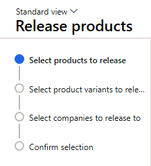
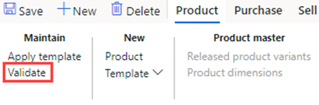

---
lab:
  title: 'النشاط المعملي 1: نشاء منتج جديد'
  module: 'Module 3: Learn the Fundamentals of Microsoft Dynamics 365 Supply Chain Management'
---

# الوحدة 3: تعرف على أساسيات إدارة سلسلة التوريد في Microsoft Dynamics 365

## النشاط المعملي 1: نشاء منتج جديد

## الهدف

في Contoso Entertainment System USA (USMF)، إنك تخطط لشراء تكوين جديد للخزانة مِن أحد البائعين. تحتاج إلى إنشاء عنصر لتمثيل التكوين الجديد. تتعلم فِي هذا التمرين المعملي كيفية إنشاء تكوينات عنصر وعناصر جديدة.

## إعداد المعمل

   - **الوقت** المقدر: 10 دقائق

## الإرشادات

في Contoso Entertainment System USA (USMF)، أنت تخطط لشراء تكوين جديد للخزانة مِن أحد البائعين. تحتاج إلى إنشاء عنصر لتمثيل التكوين الجديد.

1.  في صفحة التمويل والعمليات الرئيسية، أعلى اليسار، تحقق مِن أنك تعمل مع شركة **USMF**. إذا لزم الأمر، فِي القائمة المنسدلة للشركة، حدد **USMF**.

2.  في الجزء العلوي الأيسر، حدد القائمة عَلى شكل هامبرجر **توسيع جزء التنقل**.

3.  في جزء التنقل، حدد **الوحدات النمطية**، ثم حدد **إدارة معلومات المنتجات**. ثم فِي قائمة **المنتجات**، حدد **المنتجات**.

4.  في صفحة **المنتجات**، فِي القائمة العلوية، حدد **+ جديد**.

5.  في صفحة **منتج جديد**، فِي حقل **نوع المنتج**، تحقق مِن تحديد **العنصر**.

6.  في حقل **نوع المنتج الفرعي**، تحقق مِن تحديد **المنتج**.

7.  ضمن **IDENTIFICATION**، فِي صندوق **رقم المنتج**، أدخل **GTL007**.

8.  في المربع **اسم المنتج** أدخل **الخزانة 2**.

    

9.  حدد الزر **موافق**.

10. ضمن قائمة **المنتج** فِي جزء الإجراءات، حدد **مجموعات الأبعاد** ضمن مجموعة **الإعداد**.

    

11. حدد القائمة المنسدلة **لمجموعة أبعاد التخزين** وحدد **SiteWH**.

12. حدد القائمة المنسدلة للحقل **مجموعة أبعاد التعقب** وحدد **بدون**.

13. حدد الزر **موافق**.

14. حدد زر **تحرير المنتجات** فِي جزء الإجراءات لتحرير المنتج فِي كيان قانوني.

15. تفتح صفحة تعرض الخطوة الأولى عَلى أنها **تحديد المنتجات المراد إصدارها**.

    

16. حدد الزر **التالي** فِي أسفل الصفحة

17. في الصفحة **تحديد الشركات المراد إصدارها** فِي الصفحة، حدد الكيان القانوني **USMF** حيث يجب إصدار المنتج.

18. حدد الزر **التالي** فِي أسفل الصفحة.

19. في صفحة **تأكيد التحديد**، قم بتعيين قيمة **إظهار المعلومات عند الفشل** عَلى أنها **نعم** و**تشغيل كدُفعة** عَلى أنها **لا.**

20. حدد الزر **إنهاء** فِي أسفل الصفحة.

21. في جزء التنقل، حدد الوحدات النمطية، ثم حدد إدارة معلومات المنتجات. ثم فِي قائمة المنتجات، حدد المنتجات **الصادرة**.

22. في صفحة المنتجات** التي تم إصدارها****، حدد موقع العنصر **الجديد GTL007** في **الشبكة. 

23. حدد ارتباط المنتج وانتقل إلى صفحة **تفاصيل المنتج**.

24. في علامة التبويب السريعة **عام**، أدخل ما يلي:

    - **مجموعة نموذج العنصر**: FIFO

25. في علامة التبويب السريعة **الشراء**، أدخل ما يلي:

    - **الوحدة**: ea

    - **مجموعة ضريبة المبيعات للأصناف**: الكل

    - **السعر**: 30

26. في علامة التبويب السريعة **البيع**، أدخل ما يلي:

    - **الوحدة**: ea

    - **مجموعة ضريبة المبيعات للأصناف**: الكل

    - **السعر**: 35

27. في علامة التبويب السريعة **إدارة المخزون**، أدخل ما يلي:

    - **الوحدة**: ea

28. في علامة التبويب السريعة **المهندس**، أدخل ما يلي:

    - **وحدة BOM**: ea

29. في علامة التبويب السريعة **إدارة التكاليف**، أدخل ما يلي:

    - **مجموعة الأصناف**: الصوت

30. لإكمال التكوين، حدد المنتج فِي جزء الإجراءات. حدد زر التحقق مِن الصحة ضمن مجموعة الصيانة

    

31. تحقق مِن تقديمك مع شعار المعلومات الذي يؤكد أنه تم التحقق مِن صحة جميع قيم الحقول المطلوبة.

    

32. أغلق كل الصفحات وارجع إلى الصفحة الرئيسية.
