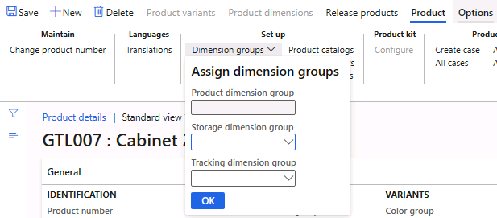

---
lab:
  title: 'النشاط المعملي 1: نشاء منتج جديد'
  module: 'Module 3: Learn the Fundamentals of Microsoft Dynamics 365 Supply Chain Management'
---

# الوحدة الثالثة: تعرف على أساسيات Microsoft Dynamics 365 - Supply Chain Management

## النشاط المعملي 1: نشاء منتج جديد

## الهدف

في Contoso Entertainment System USA (USMF)، تخطط لشراء تكوين جديد لخزانة من بائع.  تحتاج إلى إنشاء عنصر لتمثيل التكوين الجديد.  في هذا التمرين المعملي، ستتعلم كيفية إنشاء تكوينات عنصر وعنصر جديد.

## إعداد النشاط المعملي

   - **الزمن المقدر**: 10 دقائق

## الإرشادات

في Contoso Entertainment System USA (USMF)، تخطط لشراء تكوين جديد لخزانة من بائع.  تحتاج إلى إنشاء عنصر لتمثيل التكوين الجديد. 

1.  في الصفحة الرئيسية للتمويل والعمليات، في أعلى اليمين، تحقق من أنك تعمل مع شركة **USMF** . إذا لزم الأمر، في القائمة المنسدلة للشركة، حدد **USMF**.

2.  في الجزء العلوي الأيسر، حدد قائمة توسيع هامبرغر **جزء التنقل** .

3.  في جزء التنقل، حدد "**Modules**"، ثم حدد "**Product information management**". ثم في قائمة **المنتجات** ، حدد **المنتجات**.

4.  في صفحة **المنتجات** ، في القائمة العلوية، حدد **+ جديد**.

5.  في صفحة **منتج جديد** ، في حقل **نوع المنتج** ، تحقق من تحديد **العنصر** .

6.  في الحقل **نوع المنتج الفرعي** ، تحقق من تحديد **المنتج** .

7.  ضمن **التعريف**، في مربع **رقم المنتج** ، أدخل **GTL007**.

8.  في المربع **Product name**، أدخل **Cabinet 2**.

    

9.  حدد الزر **موافق**.

10. ضمن قائمة **Product** في Action Pane، حدد **Dimension groups** ضمن مجموعة **Set up** .

    

11. حدد القائمة المنسدلة **مجموعة أبعاد التخزين** وحدد **SiteWH**.

12. حدد القائمة المنسدلة **Tracking dimension group** وحدد **None**.

13. حدد الزر **موافق**.

14. حدد الزر **Release products** في Action Pane لتحرير المنتج في كيان قانوني.

15. تفتح صفحة تعرض الخطوة الأولى على أنها **تحديد المنتجات المراد إصدارها.**

    

16. حدد الزر **التالي** في أسفل الصفحة

17. في صفحة **Select companies to release to** ، حدد الكيان القانوني **USMF** حيث يجب إصدار المنتج.

18. حدد الزر **التالي** في أسفل الصفحة.

19. في صفحة **Confirm selection** ، قم بتعيين قيمة **Show Infolog عند الفشل** ك **نعم** وتشغيل **كدفعة** ك **لا.**

20. حدد الزر **إنهاء** في أسفل الصفحة.

21. في جزء التنقل، حدد "Modules"، ثم حدد "Product information management". ثم في قائمة المنتجات، حدد **المنتجات التي تم إصدارها** .

22. في صفحة **Releases** **products** ، حدد موقع العنصر الجديد **GTL007** في الشبكة. 

23. حدد ارتباط المنتج وانتقل إلى صفحة **تفاصيل المنتج** .

24. في **FastTab العام** ، أدخل ما يلي:

    - **مجموعة نموذج العنصر**: FIFO

25. في **Purchase** FastTab، أدخل ما يلي:

    - **الوحدة**: ea

    - **مجموعة ضريبة مبيعات العناصر**: الكل

    - **السعر**: 30

26. في علامة التبويب السريعة **بيع** ، أدخل ما يلي:

    - **الوحدة**: ea

    - **مجموعة ضريبة مبيعات العناصر**: الكل

    - **السعر**: 35

27. في **FastTab إدارة المخزون** ، أدخل ما يلي:

    - **الوحدة**: ea

28. في **FastTab للمهندس** ، أدخل ما يلي:

    - **وحدة BOM**: ea

29. في **FastTab إدارة التكاليف** ، أدخل ما يلي:

    - **مجموعة العناصر**: الصوت

30. لإكمال التكوين، حدد Product في Action Pane. حدد الزر التحقق من الصحة ضمن المجموعة الاحتفاظ

    

31. تحقق من تقديمك مع شعار المعلومات الذي يؤكد التحقق من صحة جميع قيم الحقول المطلوبة.

    

32. أغلق كل الصفحات وارجع إلى الصفحة الرئيسية.
