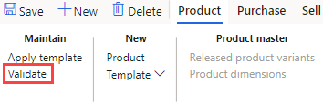

---
lab:
  title: 'النشاط المعملي 1: نشاء منتج جديد'
  module: 'Module 3: Learn the Fundamentals of Microsoft Dynamics 365 Supply Chain Management'
ms.openlocfilehash: e8fad0a9ddf0787c57ee7b98ddc6ef8363832ffc
ms.sourcegitcommit: f825cf821d4b03ce60261e296c85eabbc643cc17
ms.translationtype: HT
ms.contentlocale: ar-SA
ms.lasthandoff: 07/27/2022
ms.locfileid: "147425857"
---
# الوحدة الثالثة: تعرف على أساسيات Microsoft Dynamics 365 - Supply Chain Management

## النشاط المعملي 1 - إنشاء منتج جديد

## الأهداف

في Contoso Entertainment System USA (USMF)، تحتاج إلى إنشاء عنصر جديد لتكوين جديد للخزانة ليتم شراؤه من المورّدين.

## إعداد النشاط المعملي

   - **الزمن المقدر**: 10 دقائق

## الإرشادات

1. في صفحة Finance and Operations الرئيسية، أعلى اليسار، تحقق من أنك تعمل مع شركة USMF.

1. إذا لزم الأمر، حدد الشركة ومن القائمة، حدد **USMF**.

1. في الجزء العلوي الأيسر، حدد القائمة على شكل هامبرجر **توسيع جزء التنقل**.

1. في جزء التنقل، حدد **Modules** > **Product information management**، ثم ضمن فئة **Products**، حدد **Released products**.

1. في صفحة Released product details، في القائمة العلوية، حدد **+ New**.

1. في جزء New released product، في قائمة **Product type** تحقق من تحديد **Item**.

1. في القائمة **Product subtype**، تحقق من تحديد **Product**.

1. حدد القائمة **Tracking dimension group** ثم حدد **None**.

1. ضمن **IDENTIFICATION**، في المربعين **Product number** و **Item number**، أدخل **GTL007**.

1. في المربع **Product name**، أدخل **Cabinet 2**.

1. ضمن **REFERENCE GROUPS**، حدد قائمة **Item model group**، ثم حدد **FIFO First In-First Out**.

1. حدد قائمة **Item group** ثم حدد **TV&Video**.

1. حدد قائمة **Storage dimension group**، ثم حدد **SiteWH**.

1. ضمن **وحدات القياس**، تحقق من تعيين القيم التالية:

    | **الإعداد**| **القيمة**|
    | :--- | :--- |
    | وحدة المخزون| الكل|
    | وحدة الشراء| الكل|
    | وحدة المبيعات| الكل|
    | وحدة BOM| الكل|

1. ضمن **SALES TAXATION** حدد القائمة **Item sales tax group** ثم حدد **ALL**.

1. ضمن **PURCHASE TAXATION**، حدد القائمة **Item sales tax group**، ثم حدد **ALL**.

1. ضمن PRICES، في المربع Purchase price، أدخل 30.00.

1. في المربع Sales price، أدخل 30.00.

1. يجب أن يبدو منتجك الجديد كالتالي:

    

1. حدد "**OK**".

1. لضمان إنهاء المنتج، في الشريط الشريطي، أسفل **صيانة**، حدد **التحقق من الصحة**.

    

1. تحقق من تقديمك مع شعار المعلومات الذي يؤكد أنه تم التحقق من صحة جميع قيم الحقول المطلوبة.

    

1. أغلق كل الصفحات وارجع إلى الصفحة الرئيسية.
