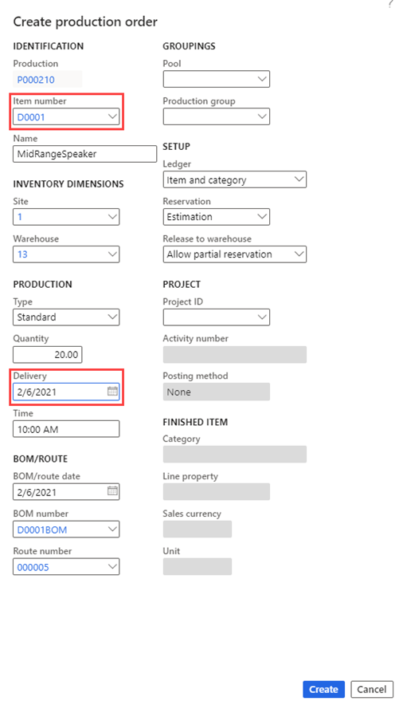

---
lab:
  title: 'النشاط المعملي 3: إنشاء أمر إنتاج'
  module: 'Module 3: Learn the Fundamentals of Microsoft Dynamics 365 Supply Chain Management'
---

# الوحدة الثالثة: تعرف على أساسيات Microsoft Dynamics 365 - Supply Chain Management

## النشاط المعملي 3: إنشاء أمر إنتاج

## الهدف

تساعد أوامر الإنتاج على بدء عملية الإنتاج في Supply Chain Management. في هذا التمرين المعملي، تصبح على دراية بواجهة المستخدم ووظائف نموذج أمر الإنتاج. ستتعلم أيضا كيفية إنشاء أمر إنتاج بنهاية التمرين.

## إعداد النشاط المعملي

   - **الزمن المقدر**: 5 minutes

## الإرشادات

1.  في الصفحة **الرئيسية Finance and Operations** ، في أعلى اليمين، تحقق من أنك تعمل مع شركة **USMF** .

2.  إذا لزم الأمر، حدد الشركة ومن القائمة، حدد **USMF**.

3.  في جزء التنقل الأيسر، حدد **Modules** > **Production control** > **Production orders** > **All production orders**.

4.  في القائمة العلوية، حدد **أمر إنتاج جديد**.

5.  ضمن "**IDENTIFICATION**"، في مربع "**Item number**"، أدخل "**D0001**".

6.  في مربع **Quantity**، أدخل **20**.

7.  ضمن **الإنتاج**، في مربع **التسليم**، حدد تاريخًا بعد شهر واحد من تاريخ اليوم.

    يشير تاريخ التسليم إلى موعد انتهاء أمر الإنتاج للتسليم في الوقت المحدد.  يمكن استخدام هذا التاريخ في عملية الجدولة. على سبيل المثال، يمكنك جدولة الطلب بأثر رجعي من تاريخ التسليم.

8.  ضمن "BOM/ROUTE"، يعرض حقل "**BOM number**" تلقائياً رقم أي BOM نشط للعنصر الحالي، ولكن يمكنك تغيير BOM لأمر الإنتاج عن طريق تحديد BOM نشط من قائمة إصدارات BOM المعتمدة.  يعرض حقل "**Route number**" تلقائياً رقم أي "مسار" نشط للعنصر الحالي، ولكن يمكنك تغيير "المسار" لأمر الإنتاج عن طريق تحديد "مسار" نشط من قائمة إصدارات "المسار" المعتمدة.

    

9.  حدد **Create**.

